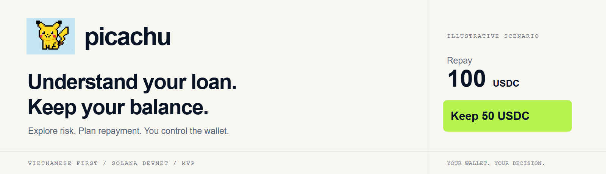
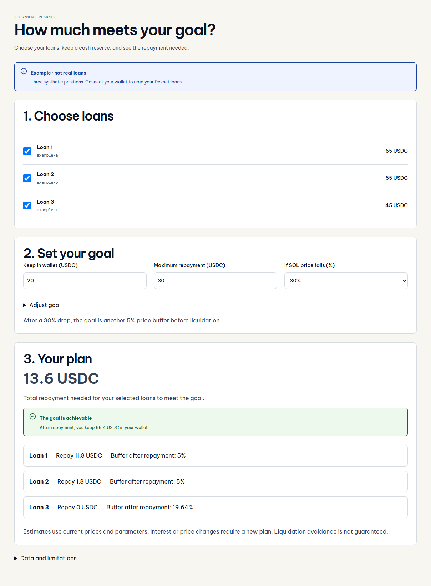
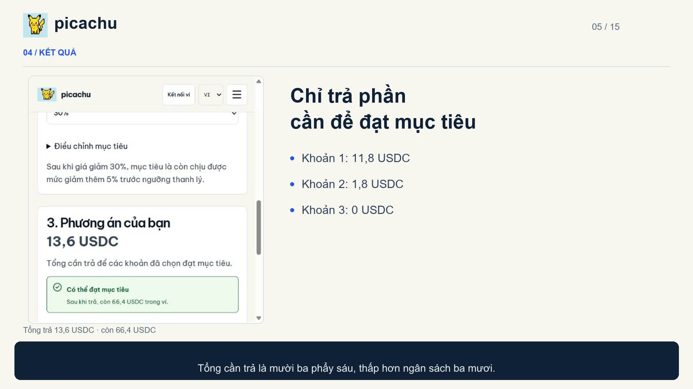
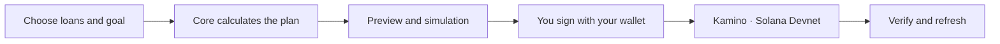
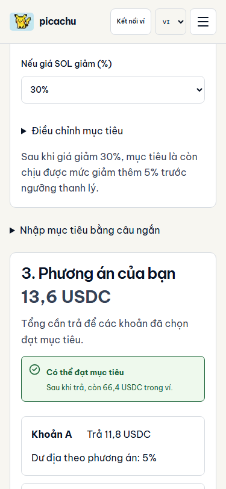

<p align="center">
  <picture>
    <source media="(prefers-color-scheme: dark)" srcset="docs/assets/readme/hero-dark.png">
    
  </picture>
</p>

<p align="center"><a href="README.md">Tiếng Việt</a> · <strong>English</strong></p>

<p align="center">
  A goal-based repayment planner for Solana borrowers.<br>
  <strong>Choose your loans. Preserve reserves. Review before you sign.</strong>
</p>

<p align="center">
  <a href="https://picachu-iota.vercel.app/portfolio"><strong>Try the app</strong></a> ·
  <a href="https://www.youtube.com/watch?v=Uw-04c9cROQ"><strong>Watch on YouTube</strong></a> ·
  <a href="docs/judging/presentation/README.md"><strong>Slides and live clip</strong></a> ·
  <a href="docs/testing/live-devnet-cycle.md">Devnet evidence</a> ·
  <a href="docs/judging/README.md">For judges</a>
</p>

<p align="center">
  <a href="https://github.com/2274802010922/picachu__/actions/workflows/quality.yml"></a>
  
  
</p>

## How much meets your goal?

Borrowers need to reduce risk when collateral prices fall while keeping funds in their wallet. picachu calculates **the repayment needed, remaining funds and distance to the goal** for up to three loans, using the user's budget and price scenario.



<p align="center"><sub>Actual interface · synthetic data · not wallet balances or on-chain proof.</sub></p>

## Watch the demo

[](https://www.youtube.com/watch?v=Uw-04c9cROQ)

**4 minutes 50 seconds · 1080p · Vietnamese · subtitles · 15 chapters.** [Watch directly on YouTube](https://www.youtube.com/watch?v=Uw-04c9cROQ), with no download required. Edited screenshots of the actual interface, explanatory graphics and Devnet receipts; no Phantom popup footage. [Documentation and optional downloads](docs/demo/README.md) · [script](docs/demo/script.md) · [subtitles](docs/demo/picachu-demo-vi.srt). Technical documents are currently in Vietnamese.

## Try it in 60 seconds

1. Open the [repayment planner](https://picachu-iota.vercel.app/portfolio); no wallet or API key required.
2. Keep budget **30 USDC**, reserve **20 USDC**, SOL price shock **30%** and buffer **5%**.
3. See **13.6 USDC** required and **66.4 USDC** remaining. Change the budget to **10** to see a **3.6 USDC** shortfall.

| Illustrative loan | Initial debt | Repayment needed |
| :---------------- | -----------: | ---------------: |
| A                 |      65 USDC |        11.8 USDC |
| B                 |      55 USDC |         1.8 USDC |
| C                 |      45 USDC |           0 USDC |
| **Total**         | **165 USDC** |    **13.6 USDC** |

Each loan has 1 SOL collateral at 100 USD; threshold 80%, borrow factor 1, USDC 1 USD; shared balance 80 USDC. Buffer is measured from the stressed price; debt-token price is fixed and accrued interest is excluded. These are synthetic assumptions. [Product scope](docs/product/README.md).

## What makes picachu useful?

**When funds are insufficient:** allocation compares estimated one-event liquidation loss plus fees against no repayment, equal split and risk-first using the same data. Users review a partial plan and sign sequentially; verified receipts do not mean all goals are met. [Model and execution](docs/architecture/liquidation-model.md) · [25 executable reference cases](docs/evidence/liquidation/README.md).

| Capability                        | Value                                                                              |
| :-------------------------------- | :--------------------------------------------------------------------------------- |
| **A goal beyond a metrics table** | Know what to repay and what to keep.                                               |
| **Several loans, one budget**     | Up to three positions without double-counting wallet funds.                        |
| **Only the required repayment**   | A loan already meeting the goal creates no extra repayment step.                   |
| **You retain signing control**    | Preview, simulation, signature/message validation and sequential signing.          |
| **Results you can inspect**       | Redis journal, receipts and a fresh goal check after repayment.                    |
| **Goals in a short sentence**     | AI or rules create a draft, the core validates it, and you review before applying. |

## Evidence beyond screenshots

| Recorded result                               | Source and scope                                                                                                                                                                            |
| :-------------------------------------------- | :------------------------------------------------------------------------------------------------------------------------------------------------------------------------------------------ |
| **3 deposits +3 borrows +2 repayments**       | Deployed Vercel API +dedicated Devnet test signer; [reports and receipts](docs/testing/live-devnet-cycle.md).                                                                               |
| **2.406756 USDC repaid; 17.401774 remaining** | Historical test cycle, reserve 1 USDC preserved; not current balances.                                                                                                                      |
| **Goals, presets and fallback**               | [Final sprint acceptance](docs/testing/final-demo-day.md), [Quality CI](https://github.com/2274802010922/picachu__/actions/workflows/quality.yml) and [test scope](docs/testing/README.md). |
| **Phantom / AI usage**                        | Owner reported successful manual testing and live AI calls; [acceptance source](docs/testing/manual-acceptance-2026-10-01.md), not agent-recorded popup footage.                            |

> [!IMPORTANT]
> MVP supports **Kamino Devnet, one wallet and one SOL/USDC pair**. Prices and interest can change after repayment; verified receipts do not guarantee avoiding liquidation. Allocation is restricted to the verified model scope; unsupported executable versions or configurations disable it. It finds the best result in a finite grid for one event, not a global optimum or probability forecast. No unverified revenue or pilot claims.

## How it works



Calculations use atomic integers and Decimal. AI only explains; the server does not hold private keys. [Architecture](docs/architecture/goal-portfolio.md) · [transactions and receipts](src/solana/transactions/) · [design system](docs/design/system.md).

## Run locally

Use Node from [`.nvmrc`](.nvmrc) and npm from [`package.json`](package.json).

```sh
git clone https://github.com/2274802010922/picachu__.git
cd picachu__
npm ci
npm run dev
```

Open `http://localhost:3000/portfolio`. Illustrative mode needs no environment variables.

```sh
npx playwright install chromium
npm run verify
node scripts/check-readme.mjs
```

For Devnet wallet usage, read [demo setup](docs/deployment/portfolio-demo.md) and the [environment checklist](docs/deployment/environment-checklist.md). Do not share wallet keys/passwords or commit secrets.

## Repository map

```text
src/       app · frontend · backend · core · solana · shared
docs/      product · demo · judging · architecture · evidence · archive
public/    application logo and assets
tests/     unit · e2e · fixtures
scripts/   validation, diagnostics and asset generation
.github/   CI and review templates
```

[Documentation](docs/README.md) · [both judging tracks](docs/judging/README.md) · [roadmap](docs/product/README.md#hướng-phát-triển) · [Codex context](docs/harness/context/CURRENT_STATE.md).

<details>
<summary><strong>Mobile and additional screens</strong></summary>



[Setup](docs/assets/screenshots/setup-en.png) · [explanation](docs/assets/screenshots/explanation-en.png) · [all screenshots](docs/assets/screenshots/README.md). The single-loan `/workspace` remains for compatibility and legacy recovery.

</details>

## Contributions and provenance

[Workflow](CONTRIBUTING.md) · [changelog](CHANGELOG.md) · [UI and dependency notices](THIRD_PARTY_NOTICES.md). The owner has not selected a license for the source code; dependencies retain their own licenses.

<p align="center"><strong>picachu</strong> · A clear goal. Your decision.</p>
