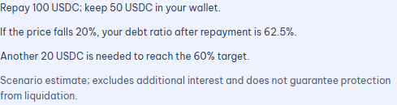
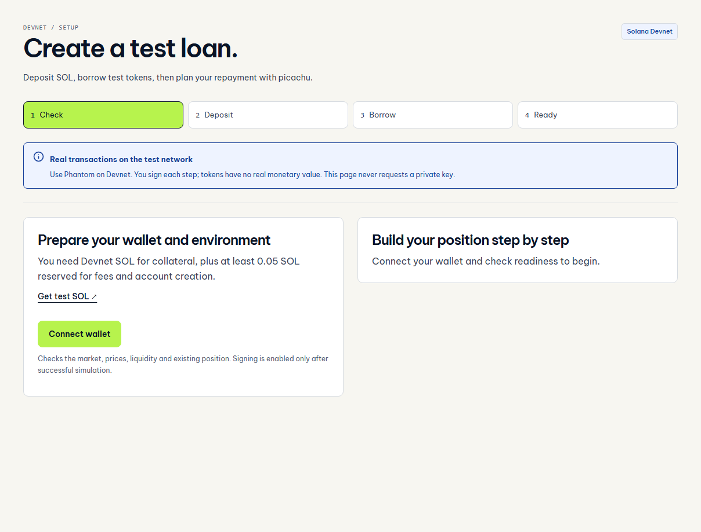
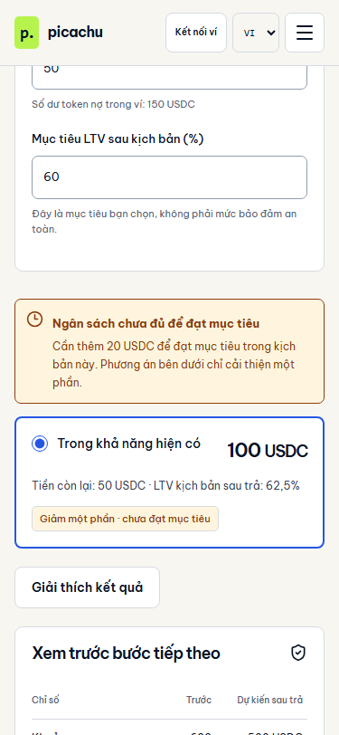
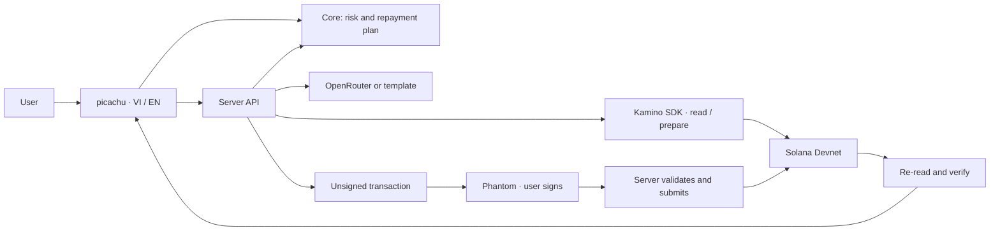

<p align="center">
  <picture>
    <source media="(prefers-color-scheme: dark)" srcset="docs/assets/readme/hero-dark.png">
    
  </picture>
</p>

<p align="center"><a href="README.md">Tiếng Việt</a> · <strong>English</strong></p>

<p align="center">
  Understand borrowing risk, explore price scenarios, and plan repayments around your budget.<br>
  <strong>Your wallet. Your budget. Your signature.</strong>
</p>

<p align="center">
  <a href="https://picachu-iota.vercel.app/portfolio"><strong>Try the demo</strong></a> ·
  <a href="docs/deployment/demo-setup.md">Devnet setup</a> ·
  <a href="docs/architecture/README.md">Architecture</a> ·
  <a href="docs/judging/README.md">For judges</a>
</p>

<p align="center">
  <a href="https://github.com/2274802010922/picachu__/actions/workflows/quality.yml"></a>
  
  
</p>


<p align="center"><sub>Actual application screenshot with synthetic data. It is not evidence of a live loan or an on-chain transaction.</sub></p>

> [!NOTE]
> **Ready to explore:** the bilingual interface, scenarios, and planner run on Vercel without a wallet or API key.
> **Tested on Devnet:** three deposits, three loans and two repayment steps through the Vercel API using a dedicated test wallet, with verified receipts. This is not full Phantom popup acceptance. Prices and interest can change after repayment; the app checks the goal again. [Transaction evidence](docs/testing/live-devnet-cycle.md).

**Current direction:** goal-based repayment for up to three loans, with a default 5% buffer measured from the stressed price, minimum required spend and a wallet reserve. Redis tracks sequential signatures and verified receipts. **Liquidation-loss allocation remains disabled:** the search engine has abstract cost-vector tests, but Kamino model parity is not verified. [Architecture](docs/architecture/goal-portfolio.md) · [Three-position demo](docs/deployment/portfolio-demo.md).

## Why picachu?

Borrowers want to reduce risk when collateral prices fall while keeping funds in their wallets. A health metric alone does not explain **how much to repay, what remains, or whether the chosen target is reached**.

picachu brings those questions into one workflow: inspect a position → explore a scenario → set a budget → compare the outcome → sign with your wallet.

## A 30-second example

In `/portfolio`, three debts of 65/55/45 USDC are each backed by 1 SOL at 100 USD; threshold 80%, borrow factor 1, wallet balance 80 USDC. With a 30% shock, 5% buffer, budget 30 and reserve 20, the minimum repayment is **11.8 + 1.8 + 0 = 13.6 USDC**, leaving **66.4 USDC**. Insufficient budgets show a shortfall without unverified partial recommendations. These are synthetic inputs.

The legacy `/workspace` retains the following single-loan example and its transaction recovery:

| Illustrative input                     |                        Value |
| :------------------------------------- | ---------------------------: |
| Collateral                             | 10 SOL × 100 USD = 1,000 USD |
| Debt / wallet token balance            |          600 USDC / 150 USDC |
| Repayment budget / reserve to keep     |           100 USDC / 50 USDC |
| SOL price scenario / target debt ratio |               Down 20% / 60% |

**Result:** repay 100 USDC and keep 50 USDC. The scenario debt ratio falls from **75% to 62.5%**; another 20 USDC repayment is needed to reach the 60% target.

This example uses an 80% liquidation threshold, borrow factor of 1 and USDC price of 1 USD. Debt-token price stays fixed and additional interest is excluded. These are explicit assumptions, not a price forecast.

## What you can do

| Capability                   | What it helps you understand                                             |
| :--------------------------- | :----------------------------------------------------------------------- |
| **Inspect a position**       | Debt, collateral, data source and freshness.                             |
| **Explore falling prices**   | Compare the current position with your chosen scenario.                  |
| **Set spending limits**      | Respect your budget, wallet balance and reserve.                         |
| **Read a short explanation** | Three factual lines; AI adds commentary, never transaction amounts.      |
| **Approve with your wallet** | Preview, simulate, sign and verify the result.                           |
| **Prepare a demo loan**      | Follow deposit and borrowing steps when the Devnet environment is ready. |

**Connect wallet** currently supports Phantom. Synthetic mode cannot create transactions. Read the [Devnet scope](docs/deployment/demo-setup.md) before testing signing.

<details>
<summary><strong>See short explanations, demo setup and mobile layout</strong></summary>

### Explanation from verified calculations



### Devnet setup



### Narrow-screen layout



These images show the interface and illustrative data, not successful live transactions.

</details>

## Try it in 60 seconds

1. Open the [picachu workspace](https://picachu-iota.vercel.app/workspace), select **EN**, and keep **Illustrative data** selected.
2. Set a **20%** price drop, **100 USDC** budget and **50 USDC** reserve.
3. Compare the before/after plan and select **Explain the results**.
4. Adjust the budget or reserve to explore the tradeoffs.

For a wallet-based demo, open [Devnet setup](https://picachu-iota.vercel.app/setup) and read the [prerequisites](docs/deployment/demo-setup.md). The documented Kamino Devnet pair passed borrowing and repayment with a dedicated test wallet. Do not use mainnet addresses on Devnet.

## For judges

| Track                       | Suggested review path                                            | Evidence                                                                                                                                                       |
| :-------------------------- | :--------------------------------------------------------------- | :------------------------------------------------------------------------------------------------------------------------------------------------------------- |
| **Best Product & Business** | User problem, example and product walkthrough                    | [Review guide](docs/judging/README.md), [demo](https://picachu-iota.vercel.app/)                                                                               |
| **Best Technical Build**    | Calculation core, wallet boundaries and transaction verification | [Architecture](docs/architecture/README.md), [testing](docs/testing/README.md), [CI](https://github.com/2274802010922/picachu__/actions/workflows/quality.yml) |

Revenue, pilots and willingness to pay have not been validated. They are future research objectives, not claimed traction.

## Status and evidence

| Area           | Verified                                                                     | Still open                                                    |
| :------------- | :--------------------------------------------------------------------------- | :------------------------------------------------------------ |
| Interface      | VI/EN, responsive layouts, keyboard access and axe across five pages         | User feedback                                                 |
| Core and build | Checkpoint `7d398c0`: 87 unit tests, 32 browser tests, build and CI passed   | Mocks do not prove protocol accuracy                          |
| Vercel         | Landing, workspace, setup and compact amounts checked on September 28, 2026  | [Smoke-test details](docs/testing/vercel-smoke-2026-09-28.md) |
| Kamino Devnet  | Three deposits, three loans and two repayments verified through deployed API | Full Phantom cycle; liquidation model parity                  |
| OpenRouter     | Owner confirmed live AI calls; adapter/fallback tested                       | User-facing quality evaluation                                |

[Latest status](docs/harness/context/CURRENT_STATE.md) · [Test scope](docs/testing/README.md) · [Acceptance checklist](docs/deployment/manual-acceptance.md)

## How it works



Atomic integers and Decimal preserve calculation precision. AI explains results; it does not choose amounts or sign transactions. The server does not hold wallet private keys. [Architecture decisions](docs/architecture/README.md).

**Built with:** Next.js · React · TypeScript · Tailwind CSS · Kamino SDK · Solana · OpenRouter · Vitest · Playwright.

## Run locally

Use Node from [`.nvmrc`](.nvmrc) and npm from [`package.json`](package.json).

```sh
git clone https://github.com/2274802010922/picachu__.git
cd picachu__
npm ci
npm run dev
```

Open `http://localhost:3000`. The illustrative demo does not require a wallet or environment variables.

```sh
npx playwright install chromium
npm run verify
```

For integrations, see [`.env.example`](.env.example), [Vercel and OpenRouter](docs/deployment/README.md), and [Kamino Devnet](docs/deployment/demo-setup.md). Keep secrets out of Git. The `check:devnet` and `check:demo` commands are read-only diagnostics, not proof of repayment.

## Repository map

| Directory                | Responsibility                                         |
| :----------------------- | :----------------------------------------------------- |
| [`app/`](app/)           | Routes and API handlers                                |
| [`frontend/`](frontend/) | Interface, language, wallet and feedback               |
| [`core/`](core/)         | Calculations and constraints independent of network/AI |
| [`backend/`](backend/)   | Preview binding and explanations                       |
| [`solana/`](solana/)     | Network guards, adapter and transactions               |
| [`shared/`](shared/)     | Data contracts and display formatting                  |
| [`tests/`](tests/)       | Unit, browser/a11y tests and fixtures                  |
| [`scripts/`](scripts/)   | Diagnostics and README asset generation                |
| [`docs/`](docs/)         | Architecture, design, deployment and evidence          |

[Documentation index](docs/README.md) · [Design system](docs/design/system.md) · [Development handoff](docs/harness/context/HANDOFF.md)

Detailed engineering documents are currently written in Vietnamese; this README provides the English overview and quick start.

## Roadmap

| Available                                                          | Being validated                                     | Next                                                                |
| :----------------------------------------------------------------- | :-------------------------------------------------- | :------------------------------------------------------------------ |
| VI/EN UI, goal planner, CI, Devnet borrowing/repayment through API | Full Phantom cycle, liquidation model and allocator | Borrower interviews, usability testing and prioritized improvements |

Swaps, multiple protocols and automation are outside the current MVP.

## Contributing and acknowledgements

Read [CONTRIBUTING](CONTRIBUTING.md) and [CHANGELOG](CHANGELOG.md). SkillBridge UI references and dependencies are acknowledged in [THIRD_PARTY_NOTICES](THIRD_PARTY_NOTICES.md).

**License:** the owner has not selected a license for picachu's source code. Do not assume an MIT license; dependencies retain their respective licenses.

---

<p align="center"><strong>picachu</strong> · Understand your loan. Choose your next step.<br><a href="https://picachu-iota.vercel.app/">Open demo</a> · <a href="README.md">Đọc tiếng Việt</a></p>
