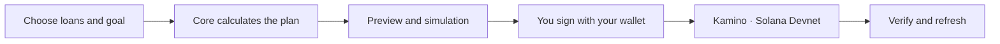

<p align="center">
  <picture>
    <source media="(prefers-color-scheme: dark)" srcset="docs/assets/readme/hero-dark.png">
    
  </picture>
</p>

<p align="center"><a href="README.md">Tiếng Việt</a> · <strong>English</strong></p>

<p align="center">
  Plan across up to three Kamino loans with one shared budget and reserve.<br>
  <strong>Choose your loans. Preserve reserves. Review before you sign.</strong>
</p>

<p align="center">
  <a href="https://picachu-iota.vercel.app/portfolio"><strong>Try the app</strong></a> ·
  <a href="https://www.youtube.com/watch?v=VzjOFclnBBg"><strong>English video</strong></a> ·
  <a href="https://www.youtube.com/watch?v=Dk57TInsyYM">Video tiếng Việt</a> ·
  <a href="docs/judging/presentation/README.md"><strong>Slides and live clip</strong></a> ·
  <a href="docs/testing/live-devnet-cycle.md">Devnet evidence</a> ·
  <a href="docs/judging/README.md">For judges</a>
</p>

<p align="center">
  <a href="https://github.com/2274802010922/picachu__/actions/workflows/quality.yml"></a>
  
  
  <a href="LICENSE"></a>
</p>

## How much meets your goal?

Borrowers need to reduce risk when collateral prices fall while keeping funds in their wallet. picachu calculates **the repayment needed, remaining funds and distance to the goal** for up to three loans, using the user's budget and price scenario.

| Strength                                   | What you can verify                                                                                                                                   |
| ------------------------------------------ | ----------------------------------------------------------------------------------------------------------------------------------------------------- |
| **One budget, several loans**              | Shared wallet funds, explicit reserves, and no extra payment for a loan already meeting the goal.                                                     |
| **Allocation when funds are insufficient** | Compare no repayment, equal split and risk-first on the same data; [reproducible example](docs/evidence/allocation/README.md).                        |
| **Verified model and execution evidence**  | [25 VM cases](docs/evidence/liquidation/README.md), preview/review, sequential signing and a [Devnet receipt](docs/testing/allocation-acceptance.md). |


<p align="center"><sub>Actual interface · synthetic data · not wallet balances or on-chain proof.</sub></p>

## Watch the demo

[](https://www.youtube.com/watch?v=VzjOFclnBBg)

**4 minutes 02 seconds · 1080p · male narration · English subtitles · 10 chapters.** [Watch in English](https://www.youtube.com/watch?v=VzjOFclnBBg) · [Tiếng Việt, 3:37](https://www.youtube.com/watch?v=Dk57TInsyYM). A complete walkthrough from loan selection and goals to budget allocation and a verified Devnet receipt. Fresh localized interface footage; synthetic data, the workflow diagram and historical receipt are clearly labeled. No Phantom popup footage. [Demo documentation](docs/demo/README.md) · [English script](docs/demo/script-en.md) · [English subtitles](docs/demo/picachu-demo-en.srt). Technical documents are currently in Vietnamese.

## Try it in 60 seconds

1. Open the [repayment planner](https://picachu-iota.vercel.app/portfolio); no wallet or API key required.
2. Keep budget **30 USDC**, reserve **20 USDC**, SOL price shock **30%** and buffer **5%**.
3. See **13.6 USDC** required and **66.4 USDC** remaining. Change the budget to **10** to see a **3.6 USDC** shortfall, then select **Explore repayment allocation**.

| Illustrative loan | Initial debt | Repayment needed |
| :---------------- | -----------: | ---------------: |
| A                 |      65 USDC |        11.8 USDC |
| B                 |      55 USDC |         1.8 USDC |
| C                 |      45 USDC |           0 USDC |
| **Total**         | **165 USDC** |    **13.6 USDC** |

Each loan has 1 SOL collateral at 100 USD; threshold 80%, borrow factor 1, USDC 1 USD; shared balance 80 USDC. Buffer is measured from the stressed price; debt-token price is fixed and accrued interest is excluded. These are synthetic assumptions. [Product scope](docs/product/README.md).

### When only 10 USDC is available

| Approach in the same example |       Budget used | Estimated one-event loss + fees | Goals met |
| ---------------------------- | ----------------: | ------------------------------: | --------: |
| No repayment                 |            0 USDC |                       ≈0.93 USD |       1/3 |
| Equal split                  |           10 USDC |                       ≈0.13 USD |       2/3 |
| Risk first                   |           10 USDC |                      0.0006 USD |       1/3 |
| **Picachu proposal**         | **9.000001 USDC** |                  **0.0006 USD** |   **1/3** |

Here the proposal matches risk-first cost and goals met while retaining nearly1 USDC of unused budget. Equal split meets more goals at a higher estimated cost: the objective is one-event loss plus fees, rather than maximizing goal count. Not all goals are met. Assumed fee6000lamports/step at SOL100USD; repayment principal is not liquidation loss. [Inputs/outputs](docs/evidence/allocation/demo-comparison.json) · [compute benchmark](docs/evidence/allocation/README.md).

<details>
<summary><strong>Feature details and execution boundaries</strong></summary>

**When funds are insufficient:** allocation compares estimated one-event liquidation loss plus fees against no repayment, equal split and risk-first using the same data. Users review a partial plan and sign sequentially; verified receipts do not mean all goals are met. [Model and execution](docs/architecture/liquidation-model.md) · [25 executable reference cases](docs/evidence/liquidation/README.md).

[A separate Devnet partial cycle](docs/testing/allocation-acceptance.md) repaid0.780982 USDC, verified its journal and retained16.620792 USDC at the test time. This used a dedicated API test signer; no Phantom signing footage is claimed.

| Capability                        | Value                                                                              |
| :-------------------------------- | :--------------------------------------------------------------------------------- |
| **A goal beyond a metrics table** | Know what to repay and what to keep.                                               |
| **Several loans, one budget**     | Up to three positions without double-counting wallet funds.                        |
| **Only the required repayment**   | A loan already meeting the goal creates no extra repayment step.                   |
| **You retain signing control**    | Preview, simulation, signature/message validation and sequential signing.          |
| **Results you can inspect**       | Redis journal, receipts and a fresh goal check after repayment.                    |
| **Goals in a short sentence**     | AI or rules create a draft, the core validates it, and you review before applying. |

</details>

## Evidence beyond screenshots

**Built here:** goals/shared funds, finite-grid allocation, arithmetic model/VM harness, quote binding and journal/recovery. **Integrated:** Kamino lending program, Solana RPC/SPL tokens, Phantom and OpenRouter. [On/off-chain responsibilities](docs/architecture/goal-portfolio.md). Keys remain in the wallet; reserve checks are off-chain/simulation checks, not a separate on-chain guard.

| Recorded result                               | Source and scope                                                                                                                                                                            |
| :-------------------------------------------- | :------------------------------------------------------------------------------------------------------------------------------------------------------------------------------------------ |
| **3 deposits +3 borrows +2 repayments**       | Deployed Vercel API +dedicated Devnet test signer; [reports and receipts](docs/testing/live-devnet-cycle.md).                                                                               |
| **2.406756 USDC repaid; 17.401774 remaining** | Historical test cycle, reserve 1 USDC preserved; not current balances.                                                                                                                      |
| **Goals, presets and fallback**               | [Final sprint acceptance](docs/testing/final-demo-day.md), [Quality CI](https://github.com/2274802010922/picachu__/actions/workflows/quality.yml) and [test scope](docs/testing/README.md). |
| **Phantom / AI usage**                        | Owner reported successful manual testing and live AI calls; [acceptance source](docs/testing/manual-acceptance-2026-10-01.md), not agent-recorded popup footage.                            |

> [!IMPORTANT]
> MVP supports **Kamino Devnet, one wallet and one SOL/USDC pair**. Prices and interest can change after repayment; verified receipts do not guarantee avoiding liquidation. Allocation is restricted to the verified model scope; unsupported executable versions or configurations disable it. It finds the best result in a finite grid for one event, not a global optimum or probability forecast. No unverified revenue or pilot claims.

## Market, alternatives and business hypothesis

The initial user already has a Kamino loan and needs to keep USDC while deciding how to repay after a SOL-price scenario. [Positions Monitor](https://github.com/csacanam/kamino-positions-monitor) already offers scenarios and target repayments; [DeFi Saver](https://defisaver.com/) offers position management and automation. Picachu focuses on shared budget/reserve, comparable allocations, explicit review/signing and verified receipts. No first-of-its-kind or competitor-absence claim.

**Buyer/revenue hypothesis:** lending wallets/dApps may pay for a hosted API, model maintenance and integration support, with borrowers as end users. Commercial API/billing, pilots and willingness-to-pay are not verified. Proposed GTM starts with a demo/sandbox and integration examples, then measures partial-plan understanding, completion/recovery and recurring demand after the competition. [Market sources, comparison and GTM](docs/product/market-and-business.md).

**Why Solana:** authoritative Kamino positions and SPL debt tokens, lending/repayment settlement, and network-confirmed receipts. Core/AI/API run off-chain. Removing chain integration leaves a calculator without live positions, execution or repayment verification.

[Dependency review](docs/testing/dependency-review-2026-10-03.md) records the patch and remaining advisories. CI and25 VM cases are not a security audit or mainnet-readiness certification.

## How it works



Calculations use atomic integers and Decimal. AI only explains; the server does not hold private keys. [Architecture](docs/architecture/goal-portfolio.md) · [transactions and receipts](src/solana/transactions/) · [design system](docs/design/system.md).

## Run locally

Use Node from [`.nvmrc`](.nvmrc) and npm from [`package.json`](package.json).

```sh
git clone https://github.com/2274802010922/picachu__.git
cd picachu__
npm ci
npm run dev
```

Open `http://localhost:3000/portfolio`. Illustrative mode needs no environment variables.

```sh
npx playwright install chromium
npm run verify
node scripts/check-readme.mjs
```

For Devnet wallet usage, read [demo setup](docs/deployment/portfolio-demo.md) and the [environment checklist](docs/deployment/environment-checklist.md). Do not share wallet keys/passwords or commit secrets.

## Repository map

```text
src/       app · frontend · backend · core · solana · shared
docs/      product · demo · judging · architecture · evidence · archive
public/    application logo and assets
tests/     unit · e2e · fixtures
scripts/   validation, diagnostics and asset generation
.github/   CI and review templates
```

[Documentation](docs/README.md) · [both judging tracks](docs/judging/README.md) · [roadmap](docs/product/README.md#hướng-phát-triển) · [Codex context](docs/harness/context/CURRENT_STATE.md).

<details>
<summary><strong>Mobile and additional screens</strong></summary>


[Setup](docs/assets/screenshots/setup-en.png) · [explanation](docs/assets/screenshots/explanation-en.png) · [all screenshots](docs/assets/screenshots/README.md). The single-loan `/workspace` remains for compatibility and legacy recovery.

</details>

## Contributions and provenance

[Workflow](CONTRIBUTING.md) · [changelog](CHANGELOG.md) · [UI and dependency notices](THIRD_PARTY_NOTICES.md).

Source code and textual documentation are offered under **[Apache-2.0](LICENSE)** to the extent of the owner's licensing rights. [NOTICE](NOTICE) · [Licensing scope](docs/legal/README.md). Dependencies, fonts and icons retain their own licenses. The supplied logo and artwork-bearing images, videos and slide media are excluded from the software grant; see [asset licensing](docs/legal/ASSETS.md).

<p align="center"><strong>picachu</strong> · A clear goal. Your decision.</p>
