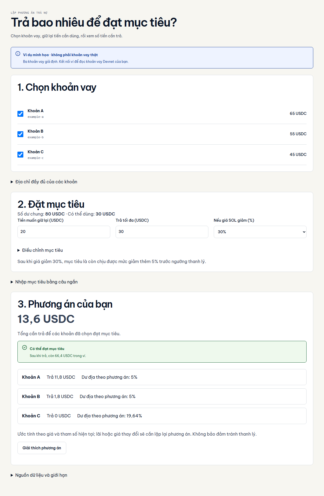
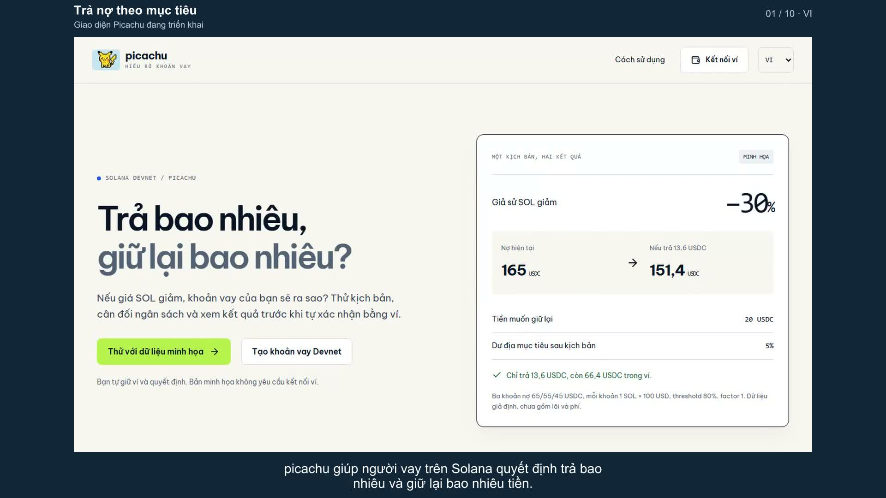
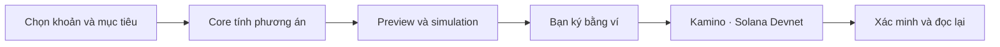

<p align="center">
  <picture>
    <source media="(prefers-color-scheme: dark)" srcset="docs/assets/readme/hero-dark.png">
    
  </picture>
</p>

<p align="center"><strong>Tiếng Việt</strong> · <a href="README.en.md">English</a></p>

<p align="center">
  Công cụ lập phương án trả nợ có mục tiêu cho người vay trên Solana.<br>
  <strong>Chọn khoản vay. Giữ tiền dự trữ. Xem lại trước khi tự ký.</strong>
</p>

<p align="center">
  <a href="https://picachu-iota.vercel.app/portfolio"><strong>Dùng thử</strong></a> ·
  <a href="https://www.youtube.com/watch?v=Dk57TInsyYM"><strong>Video tiếng Việt</strong></a> ·
  <a href="https://www.youtube.com/watch?v=VzjOFclnBBg">English video</a> ·
  <a href="docs/judging/presentation/README.md"><strong>Slide và clip live</strong></a> ·
  <a href="docs/testing/live-devnet-cycle.md">Bằng chứng Devnet</a> ·
  <a href="docs/judging/README.md">Dành cho giám khảo</a>
</p>

<p align="center">
  <a href="https://github.com/2274802010922/picachu__/actions/workflows/quality.yml"></a>
  
  
  <a href="LICENSE"></a>
</p>

## Trả bao nhiêu để đạt mục tiêu?

Người vay cần giảm rủi ro khi giá thế chấp giảm, nhưng vẫn cần tiền trong ví. picachu tính **số cần trả, tiền còn lại và khoảng cách tới mục tiêu** cho tối đa ba khoản vay, theo ngân sách và kịch bản người dùng chọn.



<p align="center"><sub>Giao diện thật · dữ liệu minh họa · không phải số dư hoặc giao dịch on-chain.</sub></p>

## Xem demo

[](https://www.youtube.com/watch?v=Dk57TInsyYM)

**3 phút 37 giây · 1080p · giọng nam · phụ đề Việt · 10 chương.** [Xem bản Việt](https://www.youtube.com/watch?v=Dk57TInsyYM) · [English, 4:02](https://www.youtube.com/watch?v=VzjOFclnBBg). Luồng hoàn chỉnh từ chọn khoản vay, đặt mục tiêu đến allocator và biên nhận Devnet. Giao diện quay mới theo từng ngôn ngữ; dữ liệu minh họa, sơ đồ thực thi và receipt lịch sử có nhãn riêng. Không quay popup Phantom. [Tài liệu demo](docs/demo/README.md) · [kịch bản](docs/demo/script-vi.md) · [phụ đề](docs/demo/picachu-demo-vi.srt).

## Thử trong 60 giây

1. Mở [phương án trả nợ](https://picachu-iota.vercel.app/portfolio), không cần ví hay API key.
2. Giữ ngân sách **30 USDC**, dự trữ **20 USDC**, giá SOL giảm **30%**, dư địa **5%**.
3. Xem tổng **13,6 USDC**, còn **66,4 USDC**. Đổi ngân sách thành **10** để thấy thiếu **3,6 USDC**, rồi chọn **Xem cách phân bổ tiền**.

| Khoản vay minh họa |   Nợ ban đầu |       Cần trả |
| :----------------- | -----------: | ------------: |
| A                  |      65 USDC |     11,8 USDC |
| B                  |      55 USDC |      1,8 USDC |
| C                  |      45 USDC |        0 USDC |
| **Tổng**           | **165 USDC** | **13,6 USDC** |

Mỗi khoản thế chấp 1 SOL × 100 USD; threshold 80%, borrow factor 1, USDC 1 USD; số dư chung 80 USDC. Dư địa đo từ giá sau kịch bản; giữ giá token nợ cố định, chưa gồm lãi phát sinh. Đây là giả định minh họa. [Phạm vi sản phẩm](docs/product/README.md).

## Điều gì làm nên picachu?

**Khi tiền không đủ:** phân bổ đề xuất dựa trên tổn thất của một lượt thanh lý cộng phí. So sánh với không trả, chia đều và ưu tiên rủi ro trên cùng dữ liệu. Người dùng duyệt partial plan và ký từng bước; receipt verified không có nghĩa mọi mục tiêu đã đạt. [Mô hình và luồng](docs/architecture/liquidation-model.md) · [25 ca đối chứng executable](docs/evidence/liquidation/README.md).

| Khả năng                             | Giá trị                                                                      |
| :----------------------------------- | :--------------------------------------------------------------------------- |
| **Mục tiêu thay vì một bảng chỉ số** | Thấy rõ trả bao nhiêu và giữ lại bao nhiêu.                                  |
| **Nhiều khoản, một ngân sách**       | Tối đa ba vị thế; không cộng trùng số dư ví.                                 |
| **Chỉ trả phần cần thiết**           | Khoản đã đạt mục tiêu không tạo bước trả dư thừa.                            |
| **Bạn giữ quyền ký**                 | Preview, simulation, kiểm chữ ký/nội dung và ký tuần tự.                     |
| **Kết quả có thể đối chiếu**         | Nhật ký Redis, receipt và kiểm lại mục tiêu theo dữ liệu mới.                |
| **Mục tiêu bằng câu ngắn**           | AI hoặc quy tắc tạo draft, core kiểm giá trị, bạn xem lại trước khi áp dụng. |

## Bằng chứng, không chỉ screenshot

| Đã ghi nhận                          | Nguồn và phạm vi                                                                                                                                                                              |
| :----------------------------------- | :-------------------------------------------------------------------------------------------------------------------------------------------------------------------------------------------- |
| **3 deposit +3 borrow +2 repay**     | API Vercel +signer Devnet riêng; có [report và receipt](docs/testing/live-devnet-cycle.md).                                                                                                   |
| **Trả 2,406756 USDC; còn 17,401774** | Số liệu vòng test lịch sử, giữ reserve 1 USDC; không gọi là số dư hiện tại.                                                                                                                   |
| **Mục tiêu, preset và fallback**     | [Nghiệm thu chung kết](docs/testing/final-demo-day.md), [Quality CI](https://github.com/2274802010922/picachu__/actions/workflows/quality.yml) và [phạm vi kiểm thử](docs/testing/README.md). |
| **Thao tác Phantom / AI**            | Owner báo test ổn và gọi AI live; [nguồn nghiệm thu thủ công](docs/testing/manual-acceptance-2026-10-01.md), không phải video agent quay popup.                                               |
| **Allocator Devnet**                 | [Vòng partial](docs/testing/allocation-acceptance.md): trả0,780982 USDC, journal verified, còn16,620792 trên ví test tại thời điểm nghiệm thu. API signer riêng, không popup Phantom.         |

> [!IMPORTANT]
> MVP chỉ dùng **Kamino Devnet, một ví, cùng cặp SOL/USDC**. Giá và lãi có thể đổi sau trả; receipt verified không bảo đảm tránh thanh lý. Allocator chỉ chạy trong phạm vi mô hình đã đối chiếu; đổi executable hoặc cấu hình không hỗ trợ sẽ chặn. Kết quả tốt nhất trong lưới hữu hạn cho một lượt thanh lý, không là tối ưu toàn cục hoặc dự báo xác suất. Không công bố doanh thu hoặc pilot chưa xác minh.

## Cách hoạt động



Atomic integer và Decimal dùng cho phép tính. AI chỉ diễn giải; server không giữ private key. [Kiến trúc](docs/architecture/goal-portfolio.md) · [vòng ký và biên nhận](src/solana/transactions/) · [design system](docs/design/system.md).

## Chạy tại máy

Node theo [`.nvmrc`](.nvmrc), npm theo [`package.json`](package.json).

```sh
git clone https://github.com/2274802010922/picachu__.git
cd picachu__
npm ci
npm run dev
```

Mở `http://localhost:3000/portfolio`. Demo minh họa không cần biến môi trường.

```sh
npx playwright install chromium
npm run verify
node scripts/check-readme.mjs
```

Dùng ví Devnet: đọc [thiết lập demo](docs/deployment/portfolio-demo.md) và [biến môi trường](docs/deployment/environment-checklist.md). Không gửi key/password hoặc commit secret.

## Bản đồ repo

```text
src/       app · frontend · backend · core · solana · shared
docs/      product · demo · judging · architecture · evidence · archive
public/    logo và asset ứng dụng
tests/     unit · e2e · fixtures
scripts/   kiểm tra, chẩn đoán và tái tạo asset
.github/   CI và template review
```

[Tài liệu](docs/README.md) · [lối đọc hai track](docs/judging/README.md) · [roadmap](docs/product/README.md#hướng-phát-triển) · [ngữ cảnh Codex](docs/harness/context/CURRENT_STATE.md).

<details>
<summary><strong>Giao diện mobile và các màn hình khác</strong></summary>


[Setup](docs/assets/screenshots/setup-vi.png) · [giải thích](docs/assets/screenshots/explanation-vi.png) · [tất cả screenshot](docs/assets/screenshots/README.md). Luồng đơn `/workspace` giữ cho tương thích và recovery cũ.

</details>

## Đóng góp và nguồn kế thừa

[Quy trình](CONTRIBUTING.md) · [changelog](CHANGELOG.md) · [nguồn UI và dependency](THIRD_PARTY_NOTICES.md).

Mã nguồn và tài liệu dạng văn bản thuộc quyền cấp phép của chủ dự án dùng **[Apache-2.0](LICENSE)**. [NOTICE](NOTICE) · [Phạm vi cấp phép](docs/legal/README.md). Dependency/font/icon giữ giấy phép riêng. Logo, ảnh và video/slide chứa artwork không thuộc license mã nguồn; xem [tài sản và ngoại lệ](docs/legal/ASSETS.md).

<p align="center"><strong>picachu</strong> · Mục tiêu rõ ràng. Quyết định vẫn ở bạn.</p>
