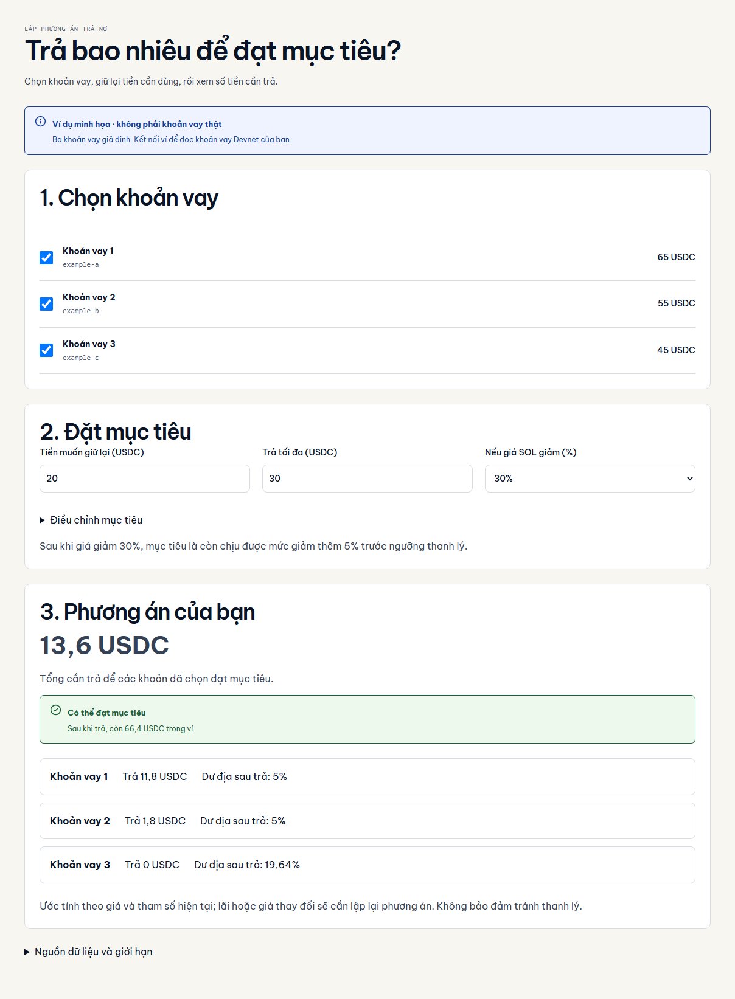
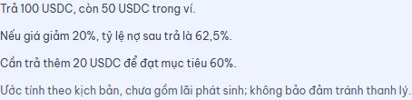
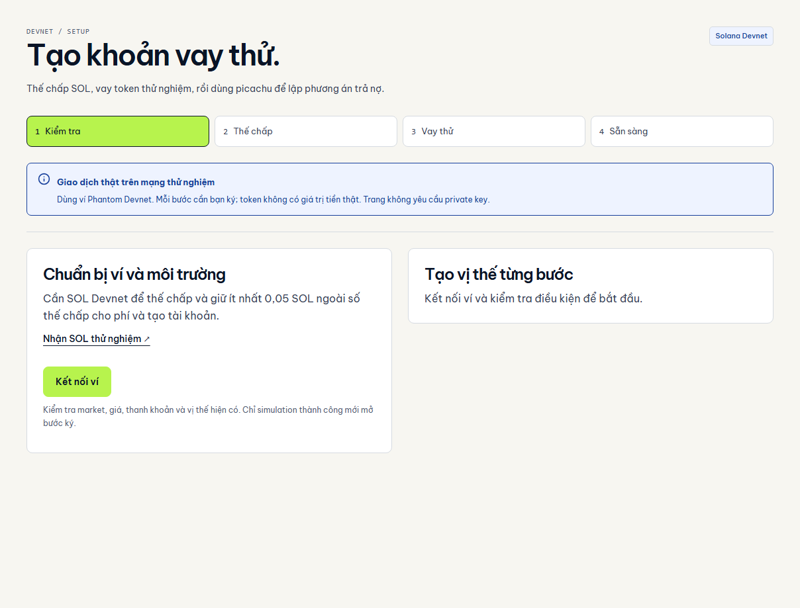
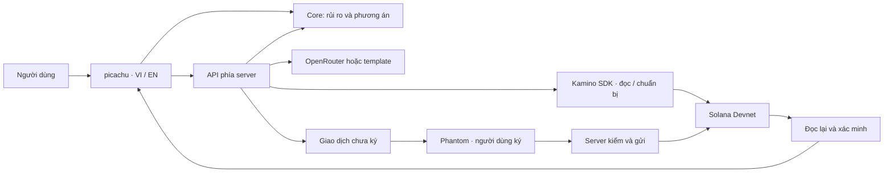

<p align="center">
  <picture>
    <source media="(prefers-color-scheme: dark)" srcset="docs/assets/readme/hero-dark.png">
    
  </picture>
</p>

<p align="center"><strong>Tiếng Việt</strong> · <a href="README.en.md">English</a></p>

<p align="center">
  Hiểu rủi ro khoản vay, thử kịch bản giá giảm và lập phương án trả nợ theo ngân sách.<br>
  <strong>Bạn giữ ví. Bạn quyết định số tiền. Bạn tự xác nhận giao dịch.</strong>
</p>

<p align="center">
  <a href="https://picachu-iota.vercel.app/portfolio"><strong>Dùng thử</strong></a> ·
  <a href="docs/deployment/demo-setup.md">Demo Devnet</a> ·
  <a href="docs/architecture/README.md">Kiến trúc</a> ·
  <a href="docs/judging/README.md">Dành cho giám khảo</a>
</p>

<p align="center">
  <a href="https://github.com/2274802010922/picachu__/actions/workflows/quality.yml"></a>
  
  
</p>



<p align="center"><sub>Ảnh chụp giao diện thật với dữ liệu minh họa — không phải bằng chứng khoản vay hoặc giao dịch trên chain.</sub></p>

> [!NOTE]
> **Có thể thử ngay:** giao diện VI/EN, mô phỏng và planner trên Vercel, không cần ví hoặc API key.
> **Đã kiểm trên Devnet:** ba lần thế chấp, ba khoản vay và hai bước trả nợ qua API Vercel bằng ví test riêng, có biên nhận xác minh. Đây không phải nghiệm thu đầy đủ popup Phantom. Giá/lãi có thể đổi sau trả; ứng dụng kiểm lại mục tiêu. [Bằng chứng giao dịch](docs/testing/live-devnet-cycle.md).

**Hướng hiện hành:** lập phương án đạt mục tiêu cho tối đa ba khoản vay. Dư địa mặc định 5% từ giá sau kịch bản, chỉ trả số cần thiết và giữ reserve. Nhật ký Redis kiểm từng bước ký/xác minh. **Allocator giảm tổn thất thanh lý chưa bật:** bộ tìm kiếm đã có test nhưng model Kamino chưa hoàn tất parity. [Kiến trúc mới](docs/architecture/goal-portfolio.md) · [Demo ba vị thế](docs/deployment/portfolio-demo.md).

## Vì sao có picachu?

Người vay muốn giảm rủi ro khi giá tài sản giảm, nhưng vẫn cần giữ tiền trong ví. Chỉ nhìn một chỉ số sức khỏe chưa giúp họ biết **trả bao nhiêu, còn lại bao nhiêu và phương án đã đạt mục tiêu hay chưa**.

picachu đặt ba câu hỏi đó trong cùng một luồng: đọc vị thế → thử kịch bản → cân đối ngân sách → xem trước kết quả → tự ký bằng ví.

## Một ví dụ trong 30 giây

Ở `/portfolio`, ba khoản nợ 65/55/45 USDC, mỗi khoản thế chấp 1 SOL × 100 USD; threshold 80%, factor 1, số dư 80 USDC. Chọn shock 30%, dư địa 5%, ngân sách 30 và reserve 20: cần trả **11,8 + 1,8 + 0 = 13,6 USDC**, giữ **66,4 USDC**. Thiếu ngân sách thì chỉ báo shortfall, không đưa ra partial chưa kiểm chứng. Đây là synthetic, không phải giao dịch chain.

Luồng đơn cũ `/workspace` giữ nguyên ví dụ sau và lịch sử recovery:

| Điều kiện minh họa                   |                      Giá trị |
| :----------------------------------- | ---------------------------: |
| Thế chấp                             | 10 SOL × 100 USD = 1.000 USD |
| Khoản nợ / số dư token trong ví      |          600 USDC / 150 USDC |
| Ngân sách trả nợ / muốn giữ lại      |           100 USDC / 50 USDC |
| Kịch bản giá SOL / mục tiêu tỷ lệ nợ |               Giảm 20% / 60% |

**Kết quả:** trả 100 USDC, giữ lại 50 USDC. Tỷ lệ nợ trong kịch bản giảm từ **75% xuống 62,5%**; cần trả thêm 20 USDC để đạt mục tiêu 60%.

Ví dụ dùng ngưỡng thanh lý 80%, borrow factor 1 và giá USDC 1 USD; giữ giá token nợ cố định, chưa gồm lãi phát sinh. Đây là giả định để khám phá sản phẩm, không phải dự báo giá.

## Những gì bạn có thể làm

| Khả năng            | Giá trị cho người dùng                                                  |
| :------------------ | :---------------------------------------------------------------------- |
| **Đọc khoản vay**   | Xem nợ, thế chấp, nguồn và độ mới của dữ liệu.                          |
| **Thử giá giảm**    | So sánh vị thế hiện tại với kịch bản bạn chọn.                          |
| **Cân đối số tiền** | Tôn trọng ngân sách, số dư và khoản muốn giữ lại.                       |
| **Hiểu kết quả**    | Ba dòng dữ kiện ngắn; AI chỉ bổ sung nhận xét, không tạo số tiền.       |
| **Tự xác nhận**     | Xem trước, simulation, ký bằng ví rồi đối chiếu trạng thái.             |
| **Thiết lập demo**  | Từng bước gửi thế chấp và vay token khi môi trường Devnet đủ điều kiện. |

Nút **“Kết nối ví”** hiện dùng Phantom. Chế độ minh họa không tạo giao dịch. Xem [phạm vi Devnet](docs/deployment/demo-setup.md) trước khi thử phần ký.

<details>
<summary><strong>Xem giải thích ngắn, thiết lập demo và giao diện mobile</strong></summary>

### Giải thích từ dữ kiện



### Thiết lập Devnet



### Trên màn hình hẹp


Các ảnh trên thể hiện giao diện và dữ liệu minh họa; không xác nhận một giao dịch đã thành công.

</details>

## Dùng thử trong 60 giây

1. Mở [workspace picachu](https://picachu-iota.vercel.app/workspace), giữ chế độ **Dữ liệu minh họa**.
2. Chọn giá giảm **20%**, ngân sách **100 USDC**, dự trữ **50 USDC**.
3. Xem phương án trước/sau, bấm **Giải thích kết quả**.
4. Thử thay đổi ngân sách hoặc dự trữ để thấy giới hạn và mục tiêu thay đổi.

Muốn dùng ví và khoản vay thử? Bắt đầu tại [trang thiết lập](https://picachu-iota.vercel.app/setup) và đọc [điều kiện cần có](docs/deployment/demo-setup.md). Cặp Kamino Devnet đã chạy vay/trả bằng ví test riêng; dùng đúng cấu hình trong tài liệu, không lấy địa chỉ mainnet để điền vào Devnet.

## Dành cho giám khảo

| Track                       | Bắt đầu từ đâu?                             | Bằng chứng                                                                                                                                                   |
| :-------------------------- | :------------------------------------------ | :----------------------------------------------------------------------------------------------------------------------------------------------------------- |
| **Best Product & Business** | Vấn đề, ví dụ trên và walkthrough sản phẩm  | [Hướng dẫn review](docs/judging/README.md), [demo](https://picachu-iota.vercel.app/)                                                                         |
| **Best Technical Build**    | Core, ranh giới ký ví và xác minh giao dịch | [Kiến trúc](docs/architecture/README.md), [kiểm thử](docs/testing/README.md), [CI](https://github.com/2274802010922/picachu__/actions/workflows/quality.yml) |

Chưa có bằng chứng doanh thu, pilot hay nhu cầu trả tiền được xác nhận. Các mục đó nằm trong kế hoạch kiểm chứng tiếp theo.

## Trạng thái và bằng chứng

| Hạng mục          | Đã kiểm chứng                                                           | Còn mở                                                         |
| :---------------- | :---------------------------------------------------------------------- | :------------------------------------------------------------- |
| Giao diện         | VI/EN, responsive, bàn phím và axe trên năm trang                       | Theo dõi phản hồi người dùng                                   |
| Core và bản build | Checkpoint `7d398c0`: 87 unit tests, 32 browser tests, build và CI PASS | Không suy ra độ chính xác protocol từ mock                     |
| Vercel            | Landing, workspace, setup và số tiền gọn đã kiểm ngày 28/09/2026        | [Chi tiết smoke test](docs/testing/vercel-smoke-2026-09-28.md) |
| Kamino Devnet     | Ba deposit, ba borrow, hai repay đã verified qua API triển khai         | Vòng Phantom đầy đủ; model liquidation parity                  |
| OpenRouter        | Owner xác nhận gọi AI live; adapter/fallback có test                    | Chưa đo chất lượng với người dùng                              |

[Trạng thái mới nhất](docs/harness/context/CURRENT_STATE.md) · [Phạm vi kiểm thử](docs/testing/README.md) · [Checklist nghiệm thu](docs/deployment/manual-acceptance.md)

## Cách hệ thống hoạt động



Atomic integer và Decimal giữ độ chính xác của core. AI diễn giải, không quyết định số tiền hoặc ký giao dịch. Server không giữ private key. [Đọc quyết định kiến trúc](docs/architecture/README.md).

**Công nghệ:** Next.js · React · TypeScript · Tailwind CSS · Kamino SDK · Solana · OpenRouter · Vitest · Playwright.

## Chạy tại máy

Dùng Node theo [`.nvmrc`](.nvmrc) và npm theo [`package.json`](package.json).

```sh
git clone https://github.com/2274802010922/picachu__.git
cd picachu__
npm ci
npm run dev
```

Mở `http://localhost:3000`. Demo minh họa không cần ví hoặc biến môi trường.

```sh
npx playwright install chromium
npm run verify
```

Để bật dịch vụ: xem [`.env.example`](.env.example), [Vercel + OpenRouter](docs/deployment/README.md) và [Kamino Devnet](docs/deployment/demo-setup.md). Không đưa secret vào Git. Các lệnh `check:devnet` và `check:demo` chỉ đọc; không chứng minh giao dịch thành công.

## Bản đồ mã nguồn và tài liệu

| Thư mục                  | Trách nhiệm                                   |
| :----------------------- | :-------------------------------------------- |
| [`app/`](app/)           | Routes và API handlers                        |
| [`frontend/`](frontend/) | Giao diện, ngôn ngữ, ví và feedback           |
| [`core/`](core/)         | Phép tính và ràng buộc độc lập với mạng/AI    |
| [`backend/`](backend/)   | Binding preview và giải thích                 |
| [`solana/`](solana/)     | Network guard, adapter và giao dịch           |
| [`shared/`](shared/)     | Data contracts và định dạng hiển thị          |
| [`tests/`](tests/)       | Unit, browser/a11y và fixtures                |
| [`scripts/`](scripts/)   | Chẩn đoán và tái tạo asset README             |
| [`docs/`](docs/)         | Kiến trúc, thiết kế, deployment và bằng chứng |

[Tài liệu tổng quan](docs/README.md) · [Design system](docs/design/system.md) · [Ngữ cảnh cho lần làm tiếp](docs/harness/context/HANDOFF.md)

## Lộ trình

| Đã có                                              | Đang kiểm chứng                                    | Tiếp theo                                                   |
| :------------------------------------------------- | :------------------------------------------------- | :---------------------------------------------------------- |
| UI VI/EN, goal planner, CI, vay/trả Devnet qua API | Phantom end-to-end, liquidation model và allocator | Phỏng vấn người vay, thử nghiệm sử dụng và ưu tiên cải tiến |

Swap, nhiều protocol và tự động hóa chưa nằm trong MVP hiện tại.

## Đóng góp và nguồn kế thừa

Đọc [CONTRIBUTING](CONTRIBUTING.md) và [CHANGELOG](CHANGELOG.md). Ghi nhận nguồn UI SkillBridge và các dependency tại [THIRD_PARTY_NOTICES](THIRD_PARTY_NOTICES.md).

**License:** chủ dự án chưa chọn giấy phép cho mã nguồn picachu. Không mặc định repo có giấy phép MIT; các dependency giữ giấy phép riêng.

---

<p align="center"><strong>picachu</strong> · Hiểu khoản vay. Chủ động bước tiếp.<br><a href="https://picachu-iota.vercel.app/">Mở demo</a> · <a href="README.en.md">Read in English</a></p>
