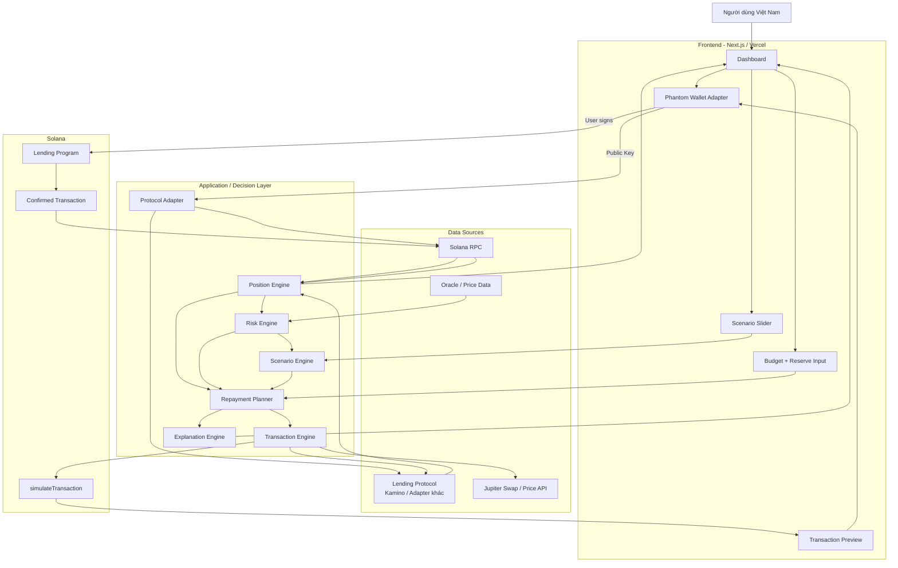
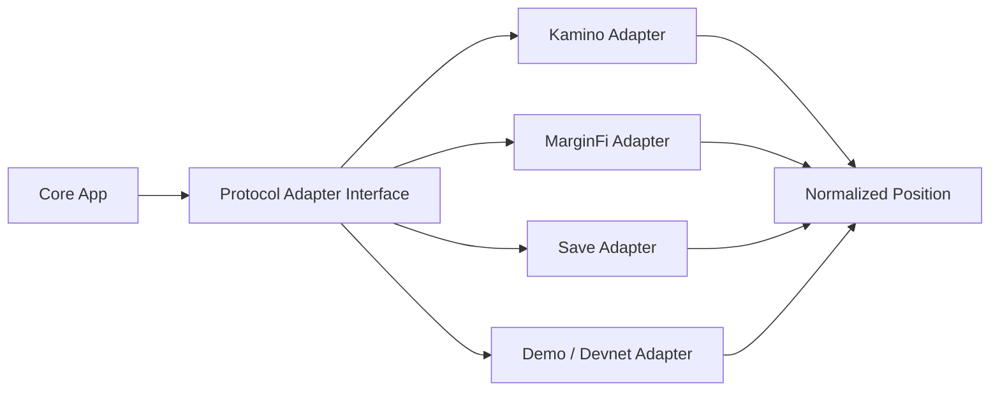
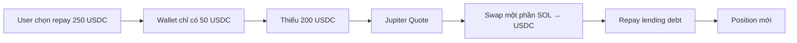
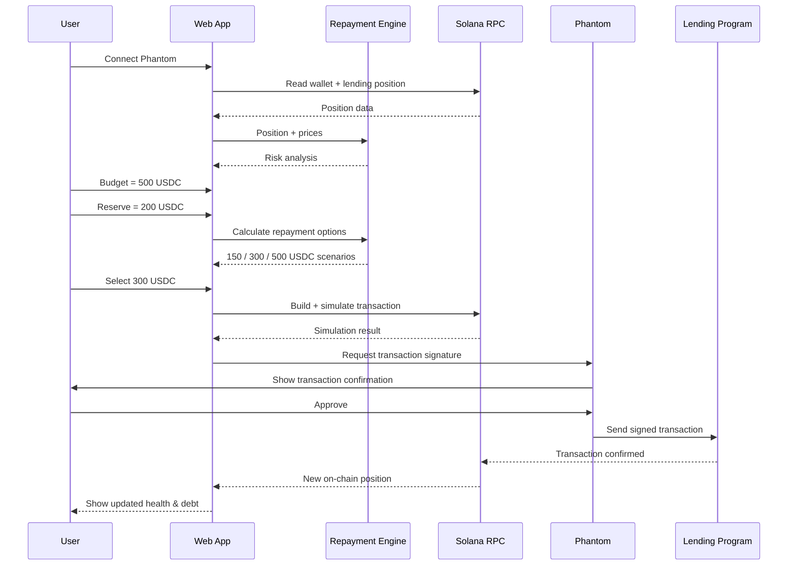
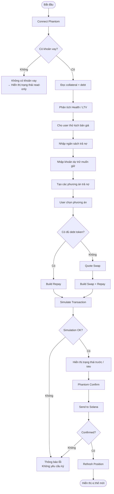
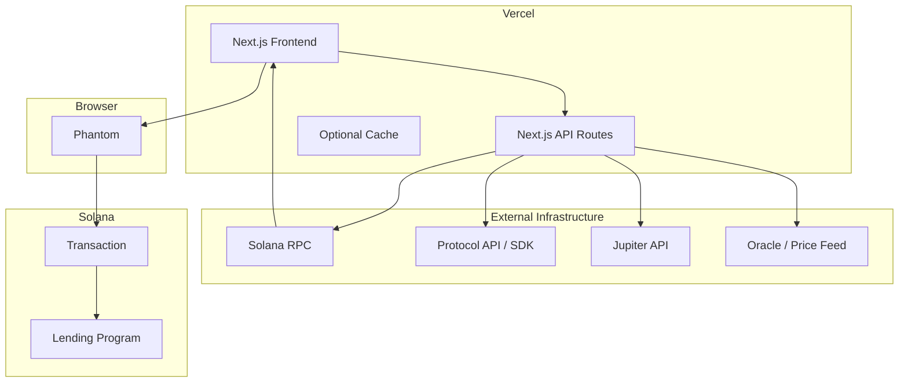
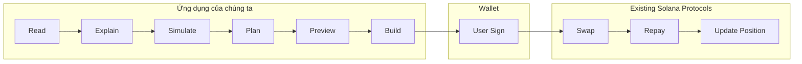

# Solana Borrow Risk & Repayment Assistant
## Kiến trúc hệ thống + luồng hoạt động + điểm mạnh dự án

> **Mục tiêu:** giúp người đang có khoản vay trên Solana hiểu vị thế hiện tại, thấy tác động khi giá tài sản biến động, tính phương án trả nợ theo **ngân sách có thể chi** và **khoản dự trữ muốn giữ**, sau đó **tự xác nhận giao dịch bằng ví Phantom**.
>
> Đây là một **decision-support / risk-management layer**, không phải một lending protocol mới và không giữ tiền của người dùng.

---

# 1. Bài toán dự án giải quyết

Người dùng DeFi thường nhìn thấy nhiều chỉ số như:

- Collateral
- Borrowed amount
- LTV
- Liquidation threshold
- Health factor
- APY
- Token price

Nhưng câu hỏi thực tế của người dùng lại thường là:

> “Nếu SOL giảm thêm 15% thì tôi có nguy hiểm không?”

> “Tôi có 500 USDC nhưng muốn giữ lại 200 USDC dự phòng. Tôi nên trả bao nhiêu nợ?”

> “Nếu trả 300 USDC thì mức an toàn của tôi tăng lên bao nhiêu?”

> “Tôi không có đúng token đang nợ. Có thể đổi tài sản đang có rồi trả nợ luôn không?”

Dự án biến các dữ liệu DeFi khó hiểu thành một luồng đơn giản:

```text
Connect Wallet
      ↓
Đọc khoản vay
      ↓
Giải thích mức rủi ro
      ↓
Mô phỏng biến động giá
      ↓
Nhập ngân sách + khoản muốn giữ lại
      ↓
Đề xuất phương án trả nợ
      ↓
Preview trạng thái sau giao dịch
      ↓
User tự xác nhận trên Phantom
      ↓
Theo dõi transaction
      ↓
Cập nhật vị thế mới
```

---

# 2. Ý tưởng cốt lõi

Dự án không cạnh tranh trực tiếp với Kamino, MarginFi, Save hay các lending protocol.

Các protocol đó chịu trách nhiệm:

- giữ collateral,
- ghi nhận debt,
- tính lãi,
- kiểm tra LTV,
- liquidation,
- xử lý repay.

Ứng dụng của chúng ta nằm **ở phía trên các protocol**:

```text
LENDING PROTOCOL
      ↓
Raw position data
      ↓
OUR DECISION LAYER
      ↓
"Bạn đang ở mức nào?"
"Nếu giá giảm thì sao?"
"Bạn có thể trả bao nhiêu?"
"Trả như vậy thì vị thế mới ra sao?"
      ↓
TRANSACTION BUILDER
      ↓
PHANTOM
      ↓
USER CONFIRM
```

## Giá trị chính

**Protocol cho người dùng dữ liệu.  
Ứng dụng của chúng ta biến dữ liệu thành quyết định.**

---

# 3. Kiến trúc tổng thể



---

# 4. Các layer chính

## Layer 1 — Wallet / Identity

### Input

Người dùng kết nối:

```text
Phantom Wallet
```

Ứng dụng chỉ cần:

```text
wallet public key
```

Không cần:

- private key,
- seed phrase,
- custody tài sản,
- tài khoản/password riêng cho MVP.

### Vai trò

```text
Wallet Address
      ↓
Tìm position của user
      ↓
Build transaction
      ↓
Phantom yêu cầu user ký
```

Điểm an toàn:

> App **không tự động rút tiền** và không được quyền ký thay user.

---

# 5. Protocol Adapter Layer

Đây là layer rất quan trọng nếu muốn sản phẩm phát triển xa hơn.



Mọi lending protocol có cách lưu dữ liệu khác nhau.

Ứng dụng chuẩn hóa về một object chung:

```ts
type LendingPosition = {
  protocol: string
  wallet: string

  collateral: {
    token: string
    amount: number
    priceUsd: number
    liquidationThreshold: number
  }[]

  debt: {
    token: string
    amount: number
    priceUsd: number
    borrowApr?: number
  }[]

  collateralValueUsd: number
  debtValueUsd: number

  currentLtv: number
  liquidationLtv?: number
  healthScore: number
}
```

Nhờ vậy Risk Engine không cần biết position đến từ Kamino hay protocol nào khác.

---

# 6. Position Engine

Position Engine chịu trách nhiệm biến raw blockchain data thành trạng thái tài chính dễ hiểu.

## Input

```text
Wallet
+
Protocol account data
+
Token balances
+
Oracle prices
+
Reserve parameters
```

## Output

Ví dụ:

```text
Collateral
10 SOL
SOL = $150
Collateral Value = $1,500

Debt
700 USDC

Current LTV
46.7%

Liquidation threshold
75%

Risk status
SAFE
```

---

# 7. Risk Engine

Risk Engine không chỉ hiển thị LTV.

Nó trả lời câu hỏi:

> “Khoản vay này đang an toàn tới mức nào?”

Một cách chuẩn hóa đơn giản:

```text
Weighted Collateral
=
Σ (
    Collateral Amount
    × Token Price
    × Liquidation Threshold
  )
```

```text
Health Score
=
Weighted Collateral
÷
Debt Value
```

Có thể biểu diễn cho người dùng dưới dạng:

```text
Health > 1.50
🟢 Khá an toàn

Health 1.20 - 1.50
🟡 Cần theo dõi

Health 1.05 - 1.20
🟠 Nguy hiểm

Health <= 1.05
🔴 Rất gần liquidation
```

> Các ngưỡng UX trên là cách diễn giải của ứng dụng. Công thức liquidation thực tế phải dùng đúng rule của protocol tương ứng.

---

# 8. Scenario Engine — phần tạo khác biệt

Đây là một trong những phần mạnh nhất của sản phẩm.

User có thể kéo:

```text
SOL PRICE

Current: $150

-10%
$135

-20%
$120

-30%
$105
```

Ứng dụng không thay đổi blockchain.

Nó tạo một **shadow position** trong bộ nhớ:

```text
Current Position
       ↓
Apply hypothetical prices
       ↓
Recalculate collateral value
       ↓
Recalculate LTV
       ↓
Recalculate health
       ↓
Estimate liquidation risk
```

Ví dụ:

| Scenario | SOL | Collateral | Debt | LTV | Status |
|---|---:|---:|---:|---:|---|
| Hiện tại | $150 | $1,500 | $700 | 46.7% | 🟢 |
| SOL -10% | $135 | $1,350 | $700 | 51.9% | 🟢 |
| SOL -20% | $120 | $1,200 | $700 | 58.3% | 🟡 |
| SOL -30% | $105 | $1,050 | $700 | 66.7% | 🟠 |

Người dùng không cần hiểu công thức.

Ứng dụng nói:

> “Nếu SOL giảm 20%, khoản vay của bạn vẫn chưa bị thanh lý nhưng vùng an toàn giảm đáng kể.”

---

# 9. Repayment Planner

Đây là phần thứ hai tạo khác biệt lớn.

User nhập:

```text
Tôi có thể dùng tối đa:
500 USDC

Tôi muốn luôn giữ lại:
200 USDC
```

Giả sử ví có:

```text
700 USDC
```

Planner tính:

```text
Spendable Balance
=
Wallet Balance
-
Desired Reserve
```

```text
Spendable Balance
=
700 - 200
=
500 USDC
```

Sau đó:

```text
Maximum Repayment
=
min(
    User Budget,
    Spendable Balance,
    Outstanding Debt
)
```

Ví dụ:

```text
User Budget        = 500
Spendable Balance  = 500
Debt               = 700

Recommended maximum repay
= 500 USDC
```

Nhưng app không nhất thiết chỉ đưa ra 1 lựa chọn.

Có thể tạo 3 phương án:

| Phương án | Trả nợ | Tiền còn lại | Health sau trả | Ý nghĩa |
|---|---:|---:|---:|---|
| Nhẹ | 150 USDC | 550 USDC | 1.55 | Giảm rủi ro một phần |
| Cân bằng | 300 USDC | 400 USDC | 2.10 | An toàn hơn rõ rệt |
| Tối đa theo ngân sách | 500 USDC | 200 USDC | 3.80 | Giảm debt mạnh nhất |

### Điều quan trọng

Ứng dụng **không nói**:

> “Bạn phải trả 500 USDC.”

Ứng dụng nói:

> “Với ngân sách và khoản dự trữ bạn chọn, đây là các phương án và trạng thái sau giao dịch.”

Quyết định cuối cùng vẫn là của user.

---

# 10. Khi user không có đúng token để trả nợ

Ví dụ:

```text
Debt:
500 USDC

Wallet:
3 SOL
50 USDC
```

User muốn trả:

```text
250 USDC
```

Nhưng chỉ có:

```text
50 USDC
```

Ứng dụng có thể đề xuất:

```text
Need
250 USDC

Already have
50 USDC

Missing
200 USDC
```

Sau đó:

```text
SOL
 ↓
Jupiter quote
 ↓
Swap SOL → USDC
 ↓
Repay USDC debt
```

Luồng:



### MVP đơn giản hơn

Hackathon MVP có thể chia thành 2 mode:

**Mode A**

```text
User đã có debt token
→ Repay trực tiếp
```

**Mode B**

```text
User thiếu debt token
→ Quote swap
→ Preview swap + repay
→ User ký
```

---

# 11. Transaction Engine

Transaction Engine là cầu nối giữa:

```text
Recommendation
```

và

```text
Actual blockchain action
```

Nó nhận:

```text
Repay 300 USDC
```

và tạo:

```text
Repay Instruction
```

hoặc:

```text
Swap Instruction
+
Repay Instruction
```

---

# 12. Pre-Transaction Simulation

Trước khi user ký:

```text
Build Transaction
       ↓
Solana simulateTransaction
       ↓
Check error
       ↓
Estimate fee
       ↓
Check resulting balances
       ↓
Show preview
```

Ví dụ UI:

```text
YOU ARE ABOUT TO:

Swap:
0.85 SOL → ~200 USDC

Repay:
250 USDC

Estimated SOL remaining:
2.15 SOL

USDC reserve after transaction:
200 USDC

Current Health:
1.24

Estimated Health After:
1.89

Network fee:
~...

[ Confirm in Phantom ]
```

---

# 13. Phantom là điểm xác nhận cuối cùng



---

# 14. End-to-end user flow



---

# 15. Kiến trúc triển khai MVP



## Stack đề xuất

| Layer | Công nghệ |
|---|---|
| Frontend | Next.js + TypeScript |
| Deploy | Vercel |
| Wallet | Phantom / Solana Wallet Adapter |
| Blockchain | Solana |
| RPC | Solana RPC provider |
| Lending integration | Protocol Adapter |
| First production adapter | Kamino-compatible |
| Swap | Jupiter |
| Pricing | Protocol oracle / Jupiter Price / oracle adapter |
| Simulation | Solana `simulateTransaction` |
| Styling | Tailwind CSS |
| State | React state / Zustand |
| Database | Không bắt buộc cho MVP |

---

# 16. Devnet strategy cho hackathon

Do mục tiêu demo là:

```text
Vercel
+
Phantom
+
Solana Devnet
```

nên kiến trúc nên tách protocol thành adapter.

## Demo Adapter

```text
Devnet Demo Position
        ↓
Normalized LendingPosition
        ↓
Risk Engine
        ↓
Scenario Engine
        ↓
Repayment Planner
        ↓
Devnet Transaction
```

## Production Adapter

```text
Real Lending Protocol
        ↓
Normalized LendingPosition
        ↓
SAME Risk Engine
        ↓
SAME Scenario Engine
        ↓
SAME Repayment Planner
```

Như vậy:

> Logic sản phẩm không bị phụ thuộc vào việc protocol cụ thể có đầy đủ deployment trên Devnet hay không.

Hackathon có thể demo toàn bộ UX trên Devnet, nhưng kiến trúc vẫn sẵn sàng nối dữ liệu lending thật sau đó.

---

# 17. Không cần smart contract riêng cho bản MVP

Một điểm đáng chú ý:

**MVP không nhất thiết phải viết lending smart contract mới.**

Blockchain đã có:

```text
Lending Protocol
+
Swap Protocol
+
Wallet
+
Solana transaction execution
```

Ứng dụng tập trung vào:

```text
Data interpretation
+
Risk simulation
+
Repayment planning
+
Transaction composition
```

Nếu muốn có smart contract riêng ở giai đoạn sau, chỉ nên thêm khi có use case thực sự như:

- policy-based automation,
- delegated repay permission,
- scheduled repayment vault,
- shared treasury,
- programmable safety rules.

Không nên tạo token hoặc smart contract chỉ để “có blockchain”.

---

# 18. Điểm mạnh số 1 — Giải quyết vấn đề sau khi đã vay

Nhiều sản phẩm tập trung vào:

```text
Should I sign this transaction?
```

Dự án này tập trung vào:

```text
I already borrowed.

What happens now?
```

Đây là layer khác:

```text
Transaction Security
        ≠
Position Risk Management
```

Ứng dụng không chỉ bảo vệ thời điểm user bấm ký.

Nó giúp user quản lý **trạng thái tài chính sau giao dịch**.

---

# 19. Điểm mạnh số 2 — Cá nhân hóa theo ngân sách thật

Các lending dashboard thường nói:

```text
Debt = $700
Health = 1.30
```

Nhưng user cần:

```text
Tôi chỉ có thể dùng $300.

Tôi phải giữ lại $200 để dự phòng.

Vậy tôi nên làm gì?
```

Ứng dụng đưa yếu tố tài chính cá nhân vào DeFi:

```text
Protocol State
+
Wallet Balance
+
User Budget
+
Desired Reserve
=
Personalized Repayment Plan
```

Đây là điểm khác biệt sản phẩm rất rõ.

---

# 20. Điểm mạnh số 3 — Explainable DeFi

Thay vì chỉ hiển thị:

```text
Health Factor = 1.24
```

app nói:

```text
Nếu SOL giảm khoảng 20%,
vùng an toàn của bạn giảm mạnh.

Nếu trả 300 USDC,
health của bạn tăng từ 1.24 → 2.10.
```

Giúp người mới hiểu được:

```text
Cause
↓
Effect
↓
Possible action
↓
Expected result
```

---

# 21. Điểm mạnh số 4 — Preview trạng thái SAU giao dịch

Đây có thể là feature demo mạnh nhất.

Trước khi ký:

```text
CURRENT
Debt: $700
Health: 1.24

AFTER REPAY
Debt: $400
Health: 2.10

Cash Reserve:
$200
```

User không chỉ thấy:

```text
"Repay 300 USDC"
```

mà còn thấy:

```text
"Nếu tôi ký transaction này,
tình trạng tài chính của tôi sẽ thay đổi như thế nào?"
```

---

# 22. Điểm mạnh số 5 — Non-custodial

Ứng dụng:

- không giữ tiền,
- không giữ private key,
- không tự ý giao dịch,
- không bắt user chuyển tài sản vào ví của app.

Flow:

```text
App recommends
      ↓
App builds
      ↓
App simulates
      ↓
User reviews
      ↓
Phantom signs
```

Điều này làm kiến trúc đơn giản và dễ tạo niềm tin hơn.

---

# 23. Điểm mạnh số 6 — Solana có vai trò thật

Blockchain không được thêm vào chỉ để “Web3”.

Ứng dụng cần Solana để:

### 1. Đọc khoản vay thật

```text
Collateral
Debt
Reserve state
Protocol parameters
```

### 2. Đọc wallet balance thật

```text
SOL
USDC
Other tokens
```

### 3. Tạo transaction thật

```text
Swap
Repay
```

### 4. Cho user tự ký

```text
Phantom
```

### 5. Xác nhận trạng thái sau giao dịch

```text
Confirmed transaction
↓
Reload on-chain position
```

Nếu bỏ blockchain:

> sản phẩm không còn biết khoản vay thật, không thể trả nợ thật và không thể xác minh trạng thái sau giao dịch.

---

# 24. Điểm mạnh số 7 — Có thể mở rộng multi-protocol

Nhờ Protocol Adapter:

```text
Kamino
MarginFi
Save
...
```

đều có thể được convert thành:

```text
Normalized Lending Position
```

Sau đó toàn bộ:

```text
Risk Engine
Scenario Engine
Repayment Planner
Explanation Engine
```

được tái sử dụng.

Đây là hướng giúp dự án từ:

```text
Kamino helper
```

trở thành:

```text
Solana Borrower Risk Layer
```

---

# 25. Điểm mạnh số 8 — Demo hackathon rất trực quan

Demo 3–5 phút có thể như sau:

## Step 1

```text
Connect Phantom
```

## Step 2

Dashboard tự hiện:

```text
Collateral: 10 SOL
Debt: 700 USDC
Health: 1.24
```

## Step 3

Kéo:

```text
SOL -20%
```

App đổi màu:

```text
🟢 → 🟠
```

## Step 4

Nhập:

```text
Budget: 500 USDC
Reserve: 200 USDC
```

## Step 5

App đưa:

```text
150 USDC
300 USDC
500 USDC
```

và trạng thái sau từng phương án.

## Step 6

Chọn:

```text
Repay 300 USDC
```

## Step 7

Preview:

```text
Health
1.24 → 2.10
```

## Step 8

```text
Confirm in Phantom
```

## Step 9

Transaction confirmed.

Dashboard reload:

```text
Debt giảm
Health tăng
```

Đây là demo có:

```text
Problem
→ Insight
→ Decision
→ Blockchain action
→ Measurable result
```

---

# 26. Core loop nên dùng khi pitch

Có thể tóm gọn toàn bộ sản phẩm bằng:

```text
CONNECT
   ↓
UNDERSTAND
   ↓
SIMULATE
   ↓
PLAN
   ↓
PREVIEW
   ↓
CONFIRM
```

hoặc:

```text
Connect → Understand → Simulate → Plan → Preview → Confirm
```

---

# 27. Value Proposition

Một câu dễ hiểu:

> **Ứng dụng giúp người vay trên Solana biết khoản vay của mình sẽ ra sao nếu thị trường biến động, tính số tiền nên trả theo ngân sách và khoản dự trữ cá nhân, rồi tự xác nhận giao dịch bằng ví.**

Phiên bản ngắn hơn:

> **Know your risk. Plan your repayment. Sign only when you understand the result.**

---

# 28. USP

## Không phải

```text
Lending App
```

## Không phải

```text
Trading Bot
```

## Không phải

```text
Transaction Scanner
```

## Mà là

```text
Borrower Decision Layer
```

Kết hợp:

```text
On-chain position
+
Market scenario
+
Personal budget
+
Desired reserve
+
Transaction simulation
```

để trả lời:

```text
What should I do,
and what happens if I do it?
```

---

# 29. Ranh giới sản phẩm nên giữ

Để MVP không bị phình quá lớn, KHÔNG nên làm ngay:

- auto-liquidation bot,
- full portfolio management,
- AI trading,
- auto borrow,
- leverage optimizer,
- yield farming recommendation,
- copy trading,
- token riêng,
- DAO,
- social layer.

Tập trung duy nhất vào:

```text
BORROW POSITION
      ↓
RISK
      ↓
SCENARIO
      ↓
REPAYMENT PLAN
      ↓
USER-SIGNED EXECUTION
```

---

# 30. MVP modules

```text
1. Wallet Connect
2. Position Reader
3. Risk Engine
4. Price Scenario Simulator
5. Budget / Reserve Input
6. Repayment Planner
7. Before / After Preview
8. Transaction Builder
9. Solana Transaction Simulation
10. Phantom Confirmation
11. Transaction Status
12. Position Refresh
```

---

# 31. MVP ưu tiên

## P0 — bắt buộc

- Phantom connect
- Read/demo lending position
- Collateral + debt
- Current risk
- Price shock simulator
- Budget input
- Reserve input
- Repayment calculation
- Before/after preview
- Phantom confirm
- Transaction status

## P1 — nếu còn thời gian

- Jupiter swap + repay
- Multiple collateral tokens
- Multiple debt tokens
- Price chart
- Transaction history
- Risk explanation in Vietnamese

## P2 — sau hackathon

- Multi-protocol support
- Notifications
- Persistent user preferences
- Automated safety policies
- Mobile experience
- Advanced stress testing

---

# 32. Recommended project boundaries



Đây là ranh giới kỹ thuật rất sạch:

> **Ứng dụng quyết định và giải thích.  
> Wallet cấp quyền.  
> Protocol thực thi.**

---

# 33. Vì sao kiến trúc này phù hợp MVP

### Không cần backend nặng

Phần lớn logic có thể chạy:

```text
Next.js
+
API Routes
+
Solana APIs
```

### Không cần custody

Không cần hạ tầng giữ tiền.

### Không cần training AI model

Risk Engine chủ yếu là deterministic calculation.

### Dễ test

Mỗi module có input/output rõ ràng.

### Dễ mở rộng

Protocol Adapter tách riêng protocol-specific code.

---

# 34. Các module code đề xuất

```text
/src
│
├── app
│   ├── dashboard
│   └── api
│
├── components
│   ├── WalletConnect.tsx
│   ├── PositionCard.tsx
│   ├── RiskGauge.tsx
│   ├── PriceScenarioSlider.tsx
│   ├── RepaymentPlanner.tsx
│   └── TransactionPreview.tsx
│
├── lib
│   ├── solana
│   │   ├── rpc.ts
│   │   ├── wallet.ts
│   │   └── simulate.ts
│   │
│   ├── protocols
│   │   ├── adapter.ts
│   │   ├── kamino.ts
│   │   └── demo.ts
│   │
│   ├── risk
│   │   ├── health.ts
│   │   ├── scenario.ts
│   │   └── liquidation.ts
│   │
│   ├── repayment
│   │   ├── budget.ts
│   │   └── planner.ts
│   │
│   ├── jupiter
│   │   ├── quote.ts
│   │   └── swap.ts
│   │
│   └── transactions
│       ├── builder.ts
│       └── preview.ts
│
└── types
    └── lending.ts
```

---

# 35. Một ví dụ demo hoàn chỉnh

## Position ban đầu

```text
Collateral:
10 SOL

SOL Price:
$150

Collateral Value:
$1,500

Debt:
700 USDC

LTV:
46.7%
```

## User thử scenario

```text
SOL -20%
```

Kết quả:

```text
SOL = $120

Collateral
$1,200

Debt
$700

LTV
58.3%

Risk
MEDIUM
```

App giải thích:

> Giá SOL giảm 20% khiến khoảng cách tới liquidation thu hẹp. Bạn có thể giảm debt để tạo thêm vùng an toàn.

---

## User nhập

```text
Budget
500 USDC

Minimum Reserve
200 USDC
```

Wallet có:

```text
700 USDC
```

App tạo:

```text
Option A
Repay 150

Option B
Repay 300

Option C
Repay 500
```

User chọn:

```text
Repay 300 USDC
```

---

## Preview

```text
BEFORE

Debt
700 USDC

AFTER

Debt
400 USDC

Cash Remaining
400 USDC

Required Reserve
200 USDC

Reserve rule
✓ satisfied

Health
1.24
      ↓
2.10
```

User bấm:

```text
Confirm
```

Phantom mở.

User ký.

Solana xác nhận.

App refresh:

```text
Debt:
400 USDC

Status:
SAFE
```

---

# 36. Pitch 20 giây

> Người dùng DeFi thường biết mình đang nợ bao nhiêu nhưng không biết nếu thị trường giảm thì khoản vay sẽ nguy hiểm đến mức nào, hoặc nên trả bao nhiêu mà vẫn giữ đủ tiền dự phòng. Sản phẩm của chúng tôi đọc vị thế vay trực tiếp từ Solana, mô phỏng biến động giá, tính các phương án trả nợ theo ngân sách và khoản dự trữ của người dùng, cho họ thấy trạng thái trước và sau giao dịch, rồi để chính họ xác nhận bằng Phantom.

---

# 37. Pitch khác biệt

> Lending protocols optimize capital.  
> Chúng tôi optimize **borrower decisions**.

Hoặc:

> Protocol cho bạn quyền vay.  
> Chúng tôi giúp bạn hiểu khi nào và trả bao nhiêu để kiểm soát rủi ro.

---

# 38. Những câu giám khảo có thể hỏi

## “Tại sao Kamino không tự làm feature này?”

Trả lời:

> Kamino tập trung vào lending infrastructure và execution. Sản phẩm của chúng tôi là một decision layer có thể đứng trên nhiều lending protocol, kết hợp trạng thái khoản vay với ngân sách và khoản dự trữ cá nhân của user. Giá trị chính không phải chỉ hiển thị health factor mà là biến nó thành các kịch bản và phương án hành động cụ thể.

---

## “Tại sao cần blockchain?”

Trả lời:

> Vì collateral, debt và trạng thái khoản vay tồn tại trực tiếp on-chain. App cần đọc trạng thái thực, dựng transaction repay thực, để user ký bằng ví và sau đó xác minh kết quả mới trên blockchain. Nếu bỏ Solana thì sản phẩm chỉ còn là một calculator giả lập.

---

## “AI ở đâu?”

Không nhất thiết phải ép AI vào core.

Core nên là:

```text
Deterministic risk calculation
```

AI có thể dùng ở layer giải thích:

```text
Raw metrics
↓
Explanation Engine
↓
Tiếng Việt dễ hiểu
```

Ví dụ:

```text
Health 1.17
```

thành:

> Khoản vay của bạn đang ở vùng rủi ro cao. Nếu tài sản thế chấp giảm thêm, khả năng bị thanh lý sẽ tăng nhanh.

AI không được tự quyết định transaction.

---

## “App có thể tự trả nợ không?”

MVP:

```text
NO
```

Flow phải là:

```text
Recommend
→ Preview
→ User confirms
→ Phantom signs
```

Điều này giúp:

- non-custodial,
- user control,
- an toàn,
- dễ demo,
- giảm complexity.

---

# 39. Điểm mạnh tổng hợp

| Điểm mạnh | Ý nghĩa |
|---|---|
| Pain point rõ | Người vay không hiểu tác động của biến động giá |
| User cụ thể | Người đã vay tài sản trên Solana |
| Actionable | Không chỉ cảnh báo mà có phương án trả nợ |
| Personalized | Dùng budget + reserve của từng user |
| Explainable | Chuyển metric DeFi thành ngôn ngữ dễ hiểu |
| Non-custodial | User luôn là người ký |
| On-chain native | Dữ liệu và execution thật trên Solana |
| Composable | Có thể dùng lending + Jupiter |
| Multi-protocol | Adapter architecture |
| Demo mạnh | Có before/after rất trực quan |
| MVP gọn | Không cần tạo lending protocol mới |
| Có đường phát triển | Từ protocol-specific → borrower risk layer |

---

# 40. Kết luận kiến trúc

Kiến trúc nên được hiểu bằng 5 lớp:

```text
┌──────────────────────────────┐
│ 1. USER / PHANTOM            │
│ user identity + final sign   │
└──────────────┬───────────────┘
               ↓
┌──────────────────────────────┐
│ 2. POSITION DATA             │
│ collateral + debt + prices   │
└──────────────┬───────────────┘
               ↓
┌──────────────────────────────┐
│ 3. DECISION ENGINE           │
│ risk + scenario + repayment  │
└──────────────┬───────────────┘
               ↓
┌──────────────────────────────┐
│ 4. TRANSACTION ENGINE        │
│ swap + repay + simulation    │
└──────────────┬───────────────┘
               ↓
┌──────────────────────────────┐
│ 5. SOLANA EXECUTION          │
│ user sign → confirm → refresh│
└──────────────────────────────┘
```

## Câu chốt

> **Đây không phải là một app giúp user vay nhiều hơn.  
> Đây là một app giúp người đã vay hiểu rủi ro, lập kế hoạch trả nợ phù hợp với khả năng tài chính của họ, và biết chính xác điều gì sẽ xảy ra trước khi họ ký giao dịch.**

---

# 41. Tài liệu kỹ thuật tham khảo

## Kamino

Kamino cung cấp developer APIs / SDKs cho:

- user positions,
- on-chain reads,
- transaction building,
- unsigned transactions.

Docs:

https://kamino.com/docs

Ví dụ kiến trúc transaction của Kamino:

```text
API builds unsigned transaction
        ↓
Client signs locally
        ↓
Send to Solana
```

Tham khảo:

https://kamino.com/docs/build/recipes/borrow/withdraw-via-api

---

## Jupiter

Jupiter cung cấp:

- token pricing,
- swap quote,
- swap routing,
- serialized transactions / instructions.

Docs:

https://developers.jup.ag/docs/get-started

Custom swap:

https://developers.jup.ag/docs/guides/how-to-build-a-custom-swap-with-metis

---

## Phantom

Phantom hỗ trợ tích hợp Solana web app thông qua:

- injected provider,
- Solana Wallet Adapter.

Docs:

https://docs.phantom.com/solana/integrating-phantom

---

## Solana transaction simulation

Trước khi gửi giao dịch có thể dùng:

```text
simulateTransaction
```

để kiểm tra transaction mà chưa cần thực sự ghi state on-chain.

Docs:

https://solana.com/docs/rpc/http/simulatetransaction

---

# 42. Ghi chú về bản kiến trúc này

Link ChatGPT/Codex được cung cấp hiện chỉ hiển thị shell của trang chia sẻ ở phía công cụ đọc web và không expose toàn bộ transcript.

Vì vậy kiến trúc trên được tổng hợp từ:

1. mô tả trực tiếp của dự án,
2. các yêu cầu trước đó về Vercel + Phantom + Solana Devnet,
3. hướng khác biệt là quản lý rủi ro trạng thái/vị thế sau giao dịch,
4. tài liệu chính thức hiện tại của Solana, Phantom, Jupiter và Kamino.

Kiến trúc được cố ý thiết kế theo kiểu adapter để phần business logic không bị khóa vào một lending protocol cụ thể.
