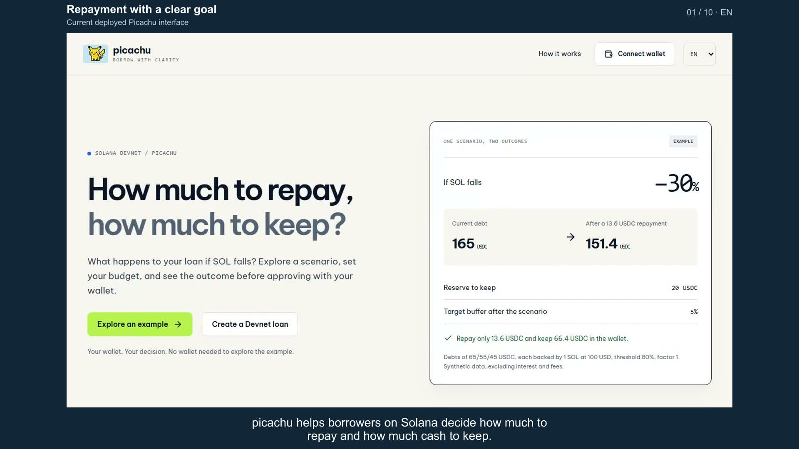

# Video và demo

Hai bản demo hoàn chỉnh, cùng luồng sản phẩm và giọng nam; giao diện, thuyết minh và phụ đề theo ngôn ngữ của từng bản. Chủ dự án upload và cung cấp hai link ngày03/10/2026.

| Bản        | Xem trực tiếp                                                         | Thời lượng | Tài liệu                                                                          |
| ---------- | --------------------------------------------------------------------- | ---------- | --------------------------------------------------------------------------------- |
| Tiếng Việt | **[YouTube Việt](https://www.youtube.com/watch?v=Dk57TInsyYM)**       | 3:37       | [Kịch bản](script-vi.md) · [SRT](picachu-demo-vi.srt) · [Chương](chapters-vi.txt) |
| English    | **[English on YouTube](https://www.youtube.com/watch?v=VzjOFclnBBg)** | 4:02       | [Script](script-en.md) · [SRT](picachu-demo-en.srt) · [Chapters](chapters-en.txt) |

1080p/H.264/AAC, giọng nam, phụ đề gắn sẵn và10 chương. Thao tác tăng tốc có chọn lọc khoảng1,5×; kết quả giữ nhịp đọc. [Release v0.4.0](https://github.com/2274802010922/picachu__/releases/tag/v0.4.0-bilingual-demo) có hai MP4 offline, SRT và gói tài liệu video. YouTube là đường xem chính; không cần tải file.

## Luồng trong video

1. Chọn ba khoản vay và đọc nguồn dữ liệu.
2. Đặt reserve20, budget30, shock30%, buffer5%: tổng13,6/còn66,4 USDC.
3. Viết mục tiêu bằng câu ngắn, xem bản nháp và áp dụng budget10.
4. Thiếu3,6 USDC: xem allocator trả9,000001, giữ ngân sách chưa dùng0,999999; vẫn là cải thiện một phần.
5. So sánh cùng dữ liệu với không trả, chia đều và ưu tiên rủi ro; phân biệt chi phí thấp nhất với đạt mọi mục tiêu.
6. Giải thích quy trình review → ký → receipt → đọc lại; đối chiếu biên nhận Devnet thật và giới hạn mô hình.

## Nguồn và giới hạn

Cảnh lập phương án quay mới từ Vercel, dùng **dữ liệu minh họa có nhãn**. Bản nháp trong footage được đọc bằng quy tắc cố định; lời thoại mô tả AI là khả năng hỗ trợ, không phải nguồn của phép tính hoặc chữ ký.

Phần thực thi là **sơ đồ giải thích**, không phải popup Phantom hoặc màn hình ứng dụng giả. Receipt0,780982 USDC/fee6000 lamports/balance16,620792 đến từ [vòng API test riêng đã xác minh](../testing/allocation-acceptance.md), là số lịch sử. Không có giao dịch gửi trong quá trình quay.

Mô hình25 ca VM khớp executable Kamino Devnet, chưa có reproducible source-build match. Finite grid, một lượt thanh lý mỗi vị thế; không dự đoán xác suất hoặc dây chuyền. Receipt thành công không đồng nghĩa mọi mục tiêu hiện tại đã đạt.

[Nghiệm thu video](../testing/bilingual-demo-2026-10-03.md) · [Manifest SHA256](video-manifest.json) · [Timeline VI](timeline-vi.json) · [Timeline EN](timeline-en.json) · [Bộ dựng](../../scripts/video-demo/README.md)

[Dùng thử](https://picachu-iota.vercel.app/portfolio) · [Thiết lập ví](../deployment/portfolio-demo.md) · [Slide/PDF và notes](../judging/presentation/README.md)

Metadata video01/10 đã chuyển vào [lưu trữ](../archive/video-2026-10-01/README.md). Các video cũ không còn là đường xem chính. File dựng, raw capture và ví test nằm ngoài Git.
