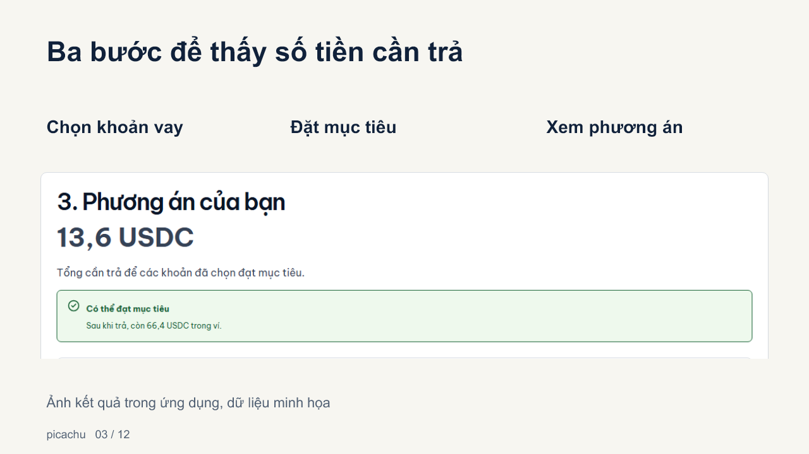
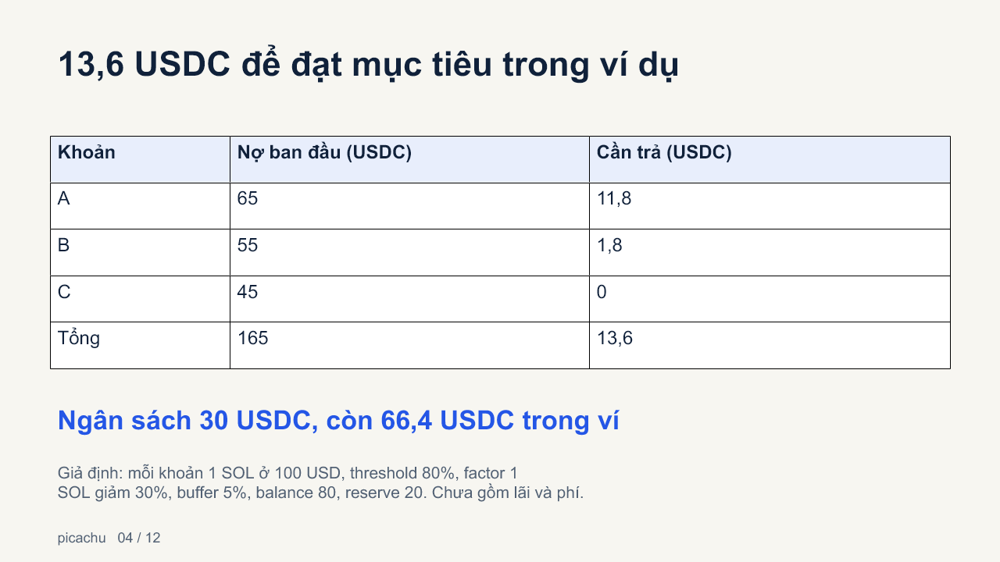
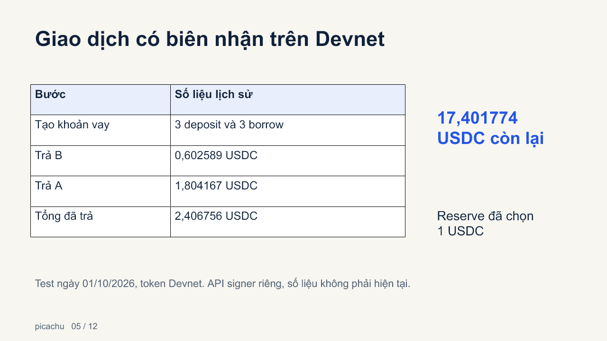
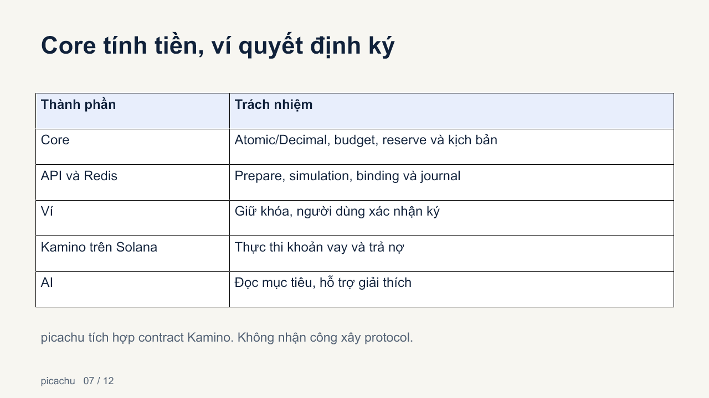

Trình bày slide

Deck12 slide theo hướng sản phẩm/demo đã kiểm, light terminal, tiếng Việt. Không phỏng vấn, không dựng traction. Kinh doanh/GTM là giả thuyết. Phân biệt dữ liệu minh họa, biên nhận Devnet lịch sử và chức năng chưa bật.

- [PowerPoint chỉnh sửa được](https://github.com/2274802010922/picachu__/releases/download/v0.2.0-final-demo/picachu-final.pptx)
- [PDF](https://github.com/2274802010922/picachu__/releases/download/v0.2.0-final-demo/picachu-final.pdf)
- [Clip thao tác dự phòng](https://github.com/2274802010922/picachu__/releases/download/v0.2.0-final-demo/picachu-live-demo.mp4)
- [Walkthrough trên YouTube](https://www.youtube.com/watch?v=Uw-04c9cROQ)
- [Lời thuyết trình](speaker-notes.md) · [Q&A](qa.md) · [Kiểm tra](../../testing/final-demo-day.md)

Clip quay thao tác trên Vercel với ví dụ synthetic, sau đó đọc receipt Devnet đã có trên Explorer. Không quay popup hoặc thao tác ký ví, không nói có giao dịch mới được gửi trong clip.

## Các slide

1. picachu và người thực hiện
2. Một ngân sách cho nhiều khoản vay
3. Luồng sản phẩm
4. Ví dụ13,6/còn66,4 USDC
5. Biên nhận Devnet lịch sử
6. Quote review, signature và recovery
7. Core/API/ví/Kamino/AI
8. Mục tiêu tự nhiên cần review
9. Giải pháp hiện có và phạm vi khác biệt
10. Business/GTM hypothesis
11. Evidence và roadmap
12. Link dùng thử và nguồn kiểm

## Xem trước

Các hình trên là bản render của PPTX. Nguồn số liệu có trong notes và evidence; PDF xuất từ các bản render, không thay file PPTX editable.
