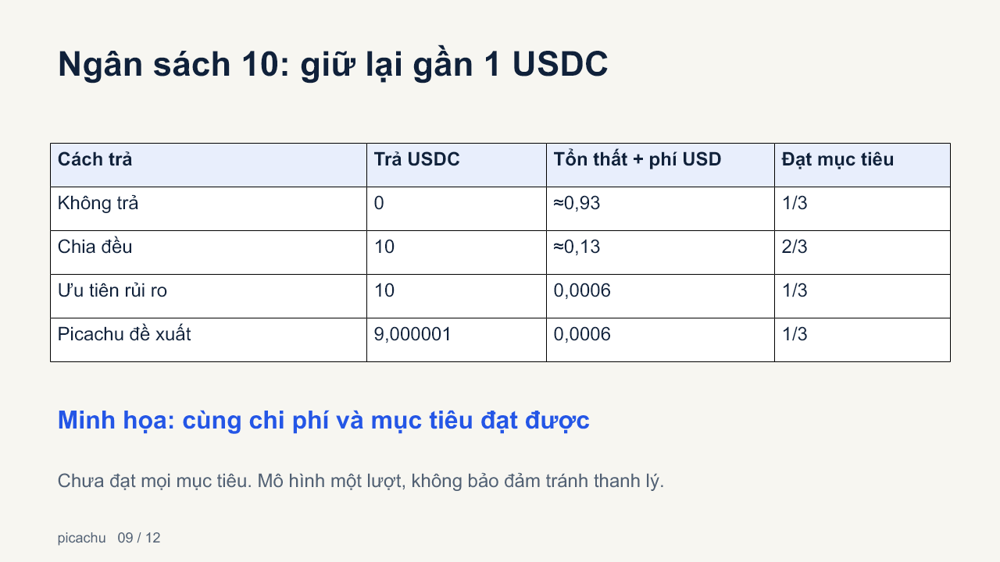
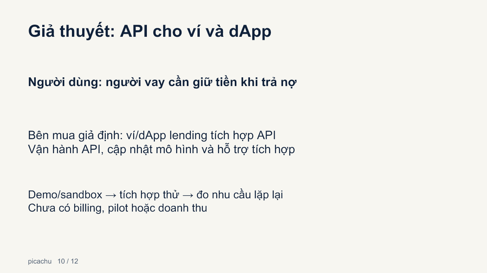
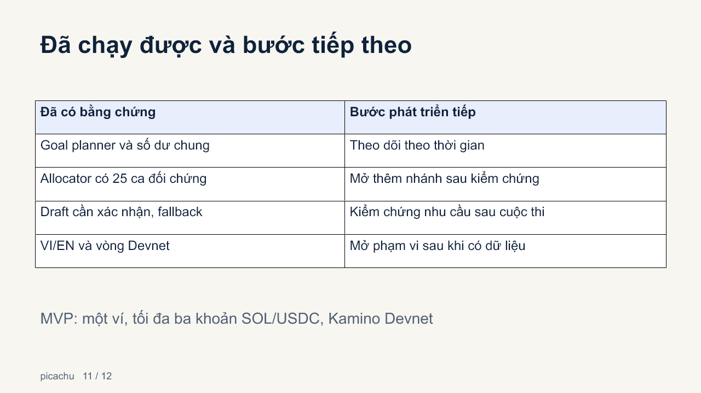

Trình bày slide

Deck12 slide theo hướng sản phẩm/demo đã kiểm, light terminal, tiếng Việt. Không phỏng vấn, không dựng traction. Kinh doanh/GTM là giả thuyết. Phân biệt dữ liệu minh họa, biên nhận Devnet lịch sử và chức năng chưa bật.

- [PowerPoint chỉnh sửa được](https://github.com/2274802010922/picachu__/releases/download/v0.4.1-final-kit/picachu-final-kit.pptx)
- [PDF](https://github.com/2274802010922/picachu__/releases/download/v0.4.1-final-kit/picachu-final-kit.pdf)
- [Gói trình bày và evidence](https://github.com/2274802010922/picachu__/releases/tag/v0.4.1-final-kit)
- [Demo hoàn chỉnh tiếng Việt3:37](https://www.youtube.com/watch?v=Dk57TInsyYM)
- [Complete English demo4:02](https://www.youtube.com/watch?v=VzjOFclnBBg)
- [Lời thuyết trình](speaker-notes.md) · [Q&A](qa.md) · [Kiểm tra](../../testing/final-demo-day.md)

Hai video mới có giọng nam, phụ đề và UI theo VI/EN, đi qua mục tiêu, draft, shortfall, allocator và receipt0,780982 USDC của vòng API test signer đã xác minh riêng. Không quay popup hoặc gửi giao dịch trong recording. Mô hình25 ca VM khớp executable, không claim source build match. [Nghiệm thu allocator](../../testing/allocation-acceptance.md) · [Tài liệu hai video](../../demo/README.md). Clip ngắn cũ đã được thay thế trong đường xem chính.

## Các slide

1. picachu và người thực hiện
2. Một ngân sách cho nhiều khoản vay
3. Luồng sản phẩm
4. Ví dụ13,6/còn66,4 USDC
5. Biên nhận Devnet lịch sử
6. Quote review, signature và recovery
7. Core/API/ví/Kamino/AI
8. Mục tiêu tự nhiên cần review
9. Baselines: cùng cost/goals, giữ gần1USDC trong ví dụbudget10
10. Buyer/API/GTM hypothesis được chọn, chưa billing/pilot
11. Evidence và roadmap
12. Link dùng thử và nguồn kiểm

## Xem trước

Các hình trên là bản render của PPTX. Nguồn số liệu có trong notes và evidence; PDF xuất từ các bản render, không thay file PPTX editable.
