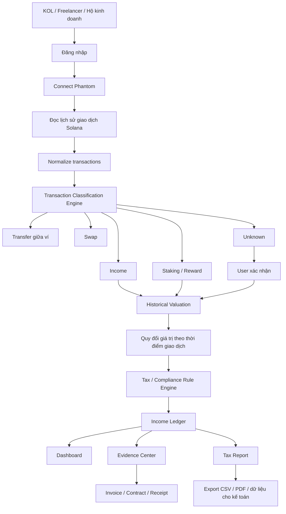
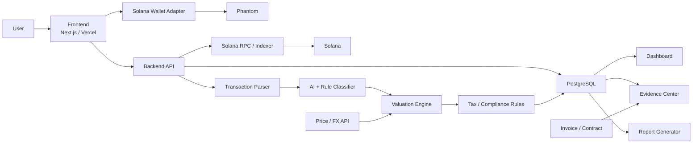
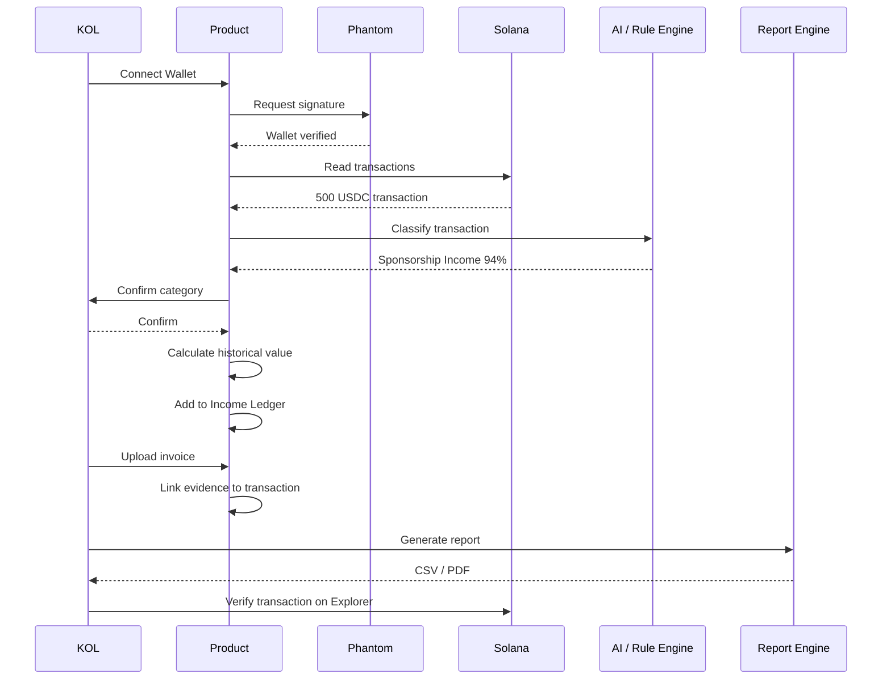
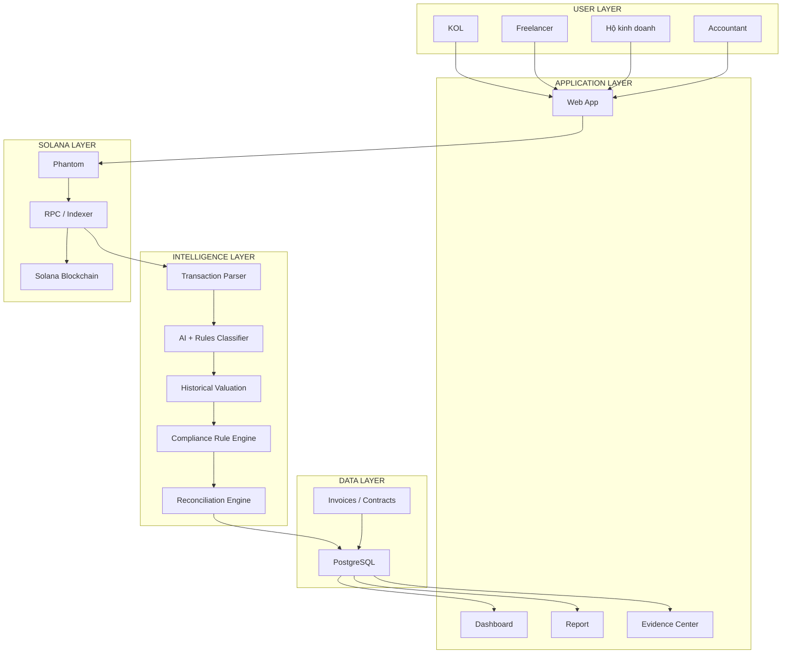
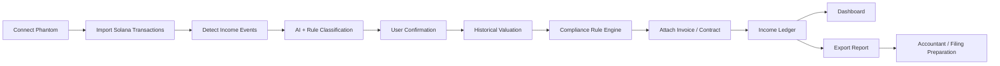

# UniHackFest 2026 — Luồng hệ thống
## Bộ công cụ kê khai cho hộ kinh doanh & KOL có thu nhập bằng tài sản số

> **Một câu mô tả**
>
> Nền tảng giúp KOL, creator, freelancer và hộ kinh doanh Việt Nam **kết nối ví Solana, tự động nhận diện các khoản thu nhập bằng tài sản số, quy đổi và phân loại giao dịch, gom chứng từ rồi xuất báo cáo phục vụ kê khai**.

---

# 1. Vì sao idea này phù hợp UniHackFest?

Idea này xuất hiện trực tiếp trong **Idea Pool 02 — Công cụ thuế & compliance cho kỷ nguyên sàn được cấp phép** của UniHackFest 2026.

UniHackFest đánh giá pool này:

- ⭐ **Khuyến nghị**
- Track: **Cả Best Product & Business và Best Technical Build**
- Độ khó: **Thấp – trung bình**
- Tín hiệu vốn: **Mạnh, đặc thù Việt Nam**
- MVP gợi ý:
  - Kết nối ví Solana
  - Kết nối thêm một nguồn dữ liệu/sàn
  - Engine tính toán
  - Dashboard
  - AI phân loại giao dịch
- Revenue gợi ý:
  - Freemium / subscription
  - B2B cho công ty kế toán
- Rủi ro chính:
  - Quy định có thể thay đổi
  - Vì vậy tax/compliance engine nên được thiết kế theo **rule có thể cập nhật**

---

# 2. Tiêu chí chấm chính của UniHackFest

## Track 01 — Best Product & Business

| Tiêu chí | Trọng số |
|---|---:|
| Bài toán thị trường + người dùng mục tiêu rõ ràng | **25%** |
| Giải pháp + demo chạy được + trải nghiệm sản phẩm | **30%** |
| Business model + doanh thu + Go-To-Market | **25%** |
| Trình bày + thuyết phục + phản biện | **20%** |

### Kết luận cho dự án

Đây là track **phù hợp nhất để ưu tiên**.

Lý do:

1. User rất cụ thể.
2. Problem dễ giải thích.
3. Demo rất trực quan.
4. Revenue model rõ.
5. Có thể tìm user thật để phỏng vấn ngay.
6. Blockchain không bị gắn vào sản phẩm một cách miễn cưỡng.

---

## Track 02 — Best Technical Build

| Tiêu chí | Trọng số |
|---|---:|
| Độ khó + chiều sâu kỹ thuật | **30%** |
| Kiến trúc on-chain/off-chain + smart contract | **25%** |
| Mức tận dụng Solana stack + composability + hiệu năng | **25%** |
| Demo hoàn thiện + trình bày | **20%** |

### Muốn thi track Technical Build

Không được dừng ở:

```text
Connect Phantom
      ↓
Đọc số dư
      ↓
Dashboard
```

Phải cho thấy:

```text
Solana transactions
      ↓
Transaction parsing
      ↓
Token detection
      ↓
Income-event detection
      ↓
AI + Rule classification
      ↓
Historical valuation
      ↓
Tax rule engine
      ↓
Evidence reconciliation
      ↓
Report generation
```

---

# 3. Người dùng mục tiêu

## Primary user

### KOL / Creator / Freelancer Việt Nam

Có nhiều nguồn thu:

- Booking quảng cáo
- Affiliate
- YouTube
- TikTok
- Khách hàng nước ngoài
- Freelance contract
- USDC
- SOL
- Token reward
- Airdrop / staking reward

Nhưng dữ liệu nằm rải rác ở:

```text
Phantom
Bank
Email
Invoice
Google Drive
Exchange
Spreadsheet
Chat / hợp đồng
```

---

## Secondary user

### Hộ kinh doanh

Cần:

- Theo dõi doanh thu
- Đối chiếu nguồn tiền
- Lưu chứng từ
- Tổng hợp giao dịch
- Chuẩn bị dữ liệu cho kế toán / kê khai

---

## B2B customer

### Công ty kế toán / dịch vụ thuế

Có thể quản lý:

```text
1 accountant
      ↓
20 / 50 / 100 clients
      ↓
Dashboard tập trung
```

Đây có thể là nhóm **sẵn sàng trả tiền mạnh hơn user cá nhân**.

---

# 4. Problem

Hiện tại một KOL có thể nhận:

```text
Brand A        → 20.000.000 VND
YouTube        → 500 USD
Brand B        → 800 USDC
Affiliate      → 7.000.000 VND
Client C       → 10 SOL
```

Sau một năm họ phải tự tìm lại:

```text
Ví nào?
↓
Transaction nào?
↓
Khoản nào là income?
↓
Khoản nào chỉ là chuyển giữa 2 ví của mình?
↓
Giá trị tại thời điểm nhận là bao nhiêu?
↓
Có invoice/hợp đồng hay không?
↓
Tổng thu nhập là bao nhiêu?
```

## Pain point chính

> **Không phải user không có dữ liệu.  
> Vấn đề là dữ liệu nằm ở nhiều nơi và không được biến thành hồ sơ tài chính có thể hiểu và kiểm tra được.**

---

# 5. Core User Flow



---

# 6. Luồng hoạt động đơn giản nhất

```text
USER
 │
 │ Connect Phantom
 ▼
WALLET
 │
 │ lịch sử giao dịch
 ▼
SOLANA
 │
 ▼
TRANSACTION INDEXER
 │
 ▼
TRANSACTION CLASSIFIER
 │
 ├── Income
 ├── Transfer
 ├── Swap
 ├── Reward
 └── Unknown
 │
 ▼
VALUATION ENGINE
 │
 │ Giá trị tại thời điểm nhận
 ▼
TAX / COMPLIANCE ENGINE
 │
 ▼
INCOME LEDGER
 │
 ├───────────────┬────────────────┐
 ▼               ▼                ▼
Dashboard    Evidence Center   Tax Report
```

---

# 7. Ví dụ thực tế

KOL Minh nhận:

```text
Ngày 15/09
Brand ABC
      ↓
500 USDC
      ↓
Phantom Wallet
```

Hệ thống đọc transaction:

```text
Transaction:
5Zp...8Xa

Token:
USDC

Amount:
500

Sender:
9Gx...2Qa

Receiver:
Minh Wallet

Timestamp:
15/09/2026 14:32
```

Sau đó hệ thống hỏi:

```text
Khoản này là gì?

[✓] Booking quảng cáo
[ ] Chuyển giữa ví
[ ] Refund
[ ] Investment
[ ] Khác
```

AI có thể đề xuất:

```text
Suggested category:
Brand Sponsorship Income

Confidence:
94%
```

User xác nhận.

Sau đó:

```text
500 USDC
    ↓
Historical FX / valuation
    ↓
Giá trị VND tại thời điểm ghi nhận
    ↓
Income Ledger
```

---

# 8. Dashboard mà user nhìn thấy

```text
┌─────────────────────────────────────┐
│ DIGITAL INCOME — 2026               │
├─────────────────────────────────────┤
│                                     │
│ Booking                320,000,000  │
│ Affiliate              160,000,000  │
│ YouTube                 95,000,000  │
│ USDC Income            210,000,000  │
│ SOL Income              45,000,000  │
│                                     │
│ TOTAL                  830,000,000  │
│                                     │
├─────────────────────────────────────┤
│ Transactions                         │
│                                     │
│ +500 USDC   Brand ABC   Income ✓    │
│ +20 SOL     Wallet X    Transfer    │
│ +300 USDC   Client A    Income ✓    │
│ -10 SOL     Jupiter     Swap        │
└─────────────────────────────────────┘
```

---

# 9. Điểm khác biệt quan trọng nhất

Hệ thống không chỉ:

> "Đọc số dư crypto."

Mà biến:

```text
RAW BLOCKCHAIN DATA
```

thành:

```text
FINANCIAL RECORD
```

Cụ thể:

```text
Transaction Hash
      +
Wallet
      +
Token
      +
Timestamp
      +
Counterparty
      +
Historical Value
      +
Income Category
      +
Invoice / Contract
      =
VERIFIABLE INCOME RECORD
```

---

# 10. Evidence Center — một feature rất mạnh

Mỗi khoản thu nhập có một bộ hồ sơ.

Ví dụ:

```text
DIGITAL INCOME RECORD
────────────────────────────────

Date:
15/09/2026

Source:
Brand ABC

Type:
Sponsorship

Payment:
500 USDC

Wallet:
7As...92K

Transaction:
5Tx...82A

Converted value:
[Giá trị quy đổi]

Evidence:
✓ Blockchain transaction
✓ Contract
✓ Invoice
✓ User confirmation
```

## Giá trị

Khi kế toán hỏi:

> "500 USDC này từ đâu?"

User không cần mở lại:

- Phantom
- email
- Drive
- Excel
- lịch sử chat

Tất cả nằm trong **một income record**.

---

# 11. Kiến trúc hệ thống



---

# 12. On-chain vs Off-chain

## On-chain

Blockchain cung cấp:

- Wallet address
- Transaction hash
- Timestamp
- Token
- Amount
- Sender
- Receiver
- Program interaction
- Transaction history

```text
Solana = nguồn dữ liệu giao dịch có thể kiểm chứng
```

## Off-chain

Database lưu:

- User account
- Transaction category
- Business description
- Counterparty name
- Invoice
- Contract
- Notes
- Tax rule version
- AI classification
- User corrections

```text
Database = business context
```

## Tại sao cần cả hai?

Blockchain biết:

```text
Wallet A → 500 USDC → Wallet B
```

Nhưng blockchain **không biết**:

```text
500 USDC đó là:
Booking?
Lương?
Refund?
Chuyển giữa 2 ví?
Khoản đầu tư?
```

Đây chính là phần sản phẩm của chúng ta giải quyết.

---

# 13. Vai trò thật sự của Blockchain

## Không dùng blockchain để:

- Lưu PDF
- Lưu invoice
- Lưu dữ liệu cá nhân
- Tạo token riêng
- Ép user thực hiện thêm transaction

## Blockchain được dùng để:

### 1. Nguồn dữ liệu giao dịch

```text
Wallet
↓
Solana
↓
Transaction history
```

### 2. Xác minh transaction

Mỗi income record có:

```text
Transaction Hash
```

Có thể kiểm chứng lại trên blockchain.

### 3. Chứng minh quyền kiểm soát ví

User:

```text
Connect Phantom
      ↓
Sign Message
      ↓
Backend verify signature
      ↓
Wallet ownership verified
```

Không cần user cung cấp private key.

### 4. Composability

Sau MVP có thể tích hợp:

```text
Wallet
DEX
Exchange
Accounting system
Tax service
Licensed digital-asset service provider
```

---

# 14. Nếu bỏ Blockchain thì mất gì?

Đây là câu giám khảo rất có thể hỏi.

## Không blockchain

User phải:

```text
Nhập giao dịch thủ công
hoặc
upload CSV
```

Và hệ thống phải tin dữ liệu user cung cấp.

## Có blockchain

Hệ thống tự lấy:

```text
Transaction
Timestamp
Amount
Asset
Wallet
Tx Hash
```

từ nguồn dữ liệu công khai có thể kiểm chứng.

### Câu trả lời ngắn

> Blockchain không được dùng vì chúng tôi muốn tạo token. Blockchain là **nguồn dữ liệu tài chính gốc** của các khoản thu nhập tài sản số mà sản phẩm cần đọc, phân loại và đối soát.

---

# 15. Tại sao Solana?

## 1. Wallet integration

```text
Phantom
+
Solana Wallet Adapter
```

rất phù hợp cho demo.

## 2. SPL Token

Có thể đọc trực tiếp:

```text
USDC
SOL
SPL Tokens
```

## 3. Transaction verification

Demo có thể:

```text
Transaction
↓
App
↓
Solana Explorer
```

Giám khảo kiểm chứng ngay.

## 4. Devnet

Có thể tạo luồng hoàn chỉnh mà không cần tiền thật.

## 5. Composability

Sau này có thể đọc hoạt động từ:

- Jupiter
- staking protocols
- payment protocols
- các Solana programs khác

---

# 16. Vai trò của AI

AI **không quyết định số thuế cuối cùng**.

AI chỉ hỗ trợ:

```text
Transaction
      ↓
Context extraction
      ↓
Suggested category
```

Ví dụ:

```text
500 USDC
Sender: Brand ABC
Memo: Campaign September
Invoice attached
```

AI đề xuất:

```text
Brand Sponsorship Income
Confidence: 94%
```

User có quyền:

```text
Accept
Edit
Reject
```

---

# 17. AI + Rule Engine

Thiết kế tốt hơn:

```text
               ┌──────────────┐
Transaction ──►│ Rule Engine  │
               └──────┬───────┘
                      │
                      ▼
               ┌──────────────┐
               │ AI Classifier│
               └──────┬───────┘
                      │
                      ▼
               Suggested Type
                      │
                      ▼
               User Confirmation
```

## Vì sao?

Tax/compliance không nên phụ thuộc hoàn toàn vào AI.

Rule engine xử lý các rule xác định được.

AI xử lý ngữ cảnh khó.

User là lớp xác nhận cuối cùng.

---

# 18. Tax / Compliance Rule Engine

Đây có thể trở thành **moat kỹ thuật + business**.

Không hard-code:

```javascript
if (year === 2026) ...
```

Nên thiết kế:

```text
Rule
├── Version
├── Effective Date
├── Income Type
├── Applicable User
├── Calculation Logic
└── Source / Reference
```

Luồng:

```text
Transaction
      ↓
Income Type
      ↓
Applicable Rule
      ↓
Calculation
      ↓
Report
```

Khi quy định thay đổi:

```text
Rule v1
↓
Rule v2
```

không cần viết lại toàn bộ hệ thống.

---

# 19. MVP nên build

## MUST BUILD

### 1. Connect Phantom

```text
Connect Wallet
+
Sign Message
```

### 2. Solana Transaction Reader

Đọc:

- SOL
- USDC
- SPL token transfer

### 3. Transaction Classification

Ít nhất:

```text
Income
Transfer
Swap
Reward
Unknown
```

### 4. Valuation

```text
Asset
+
Timestamp
↓
Historical value
↓
VND
```

### 5. Income Ledger

Danh sách income đã chuẩn hóa.

### 6. Dashboard

Hiển thị:

- Tổng income
- Income theo loại
- Transaction
- trạng thái xác nhận

### 7. Export report

Ít nhất:

```text
CSV
```

Nếu kịp:

```text
PDF
```

---

# 20. SHOULD BUILD

- Upload invoice
- Upload contract
- Evidence Center
- AI suggested category
- Rule versioning
- Search / filter
- Manual transaction correction
- Dashboard cho accountant

---

# 21. NICE TO HAVE

Không build trước khi core flow chạy tốt.

- Multi-wallet
- Multi-chain
- Exchange integration
- Bank integration
- OCR invoice
- Direct tax filing
- Mobile app
- Smart contract riêng
- Token riêng

---

# 22. Demo Flow 3–5 phút

Đây nên là demo chính trên sân khấu.

## Step 1 — Problem

Cho giám khảo thấy:

```text
KOL Minh

500 USDC
10 SOL
20 triệu VND
500 USD YouTube
```

> "Cuối năm Minh phải tự đối chiếu hàng trăm giao dịch và chứng từ."

---

## Step 2 — Connect wallet

```text
Open App
↓
Connect Phantom
↓
Sign Message
```

---

## Step 3 — Tạo transaction Devnet

Ví demo gửi:

```text
500 USDC
```

vào wallet của user.

---

## Step 4 — App phát hiện transaction

```text
New transaction detected

+500 USDC
```

Hiển thị:

```text
Tx Hash
Sender
Receiver
Timestamp
Amount
```

---

## Step 5 — AI phân loại

App:

```text
Suggested:
Brand Sponsorship

Confidence:
94%
```

User click:

```text
Confirm
```

---

## Step 6 — Income record được tạo

```text
500 USDC
↓
Historical value
↓
Income Ledger
```

---

## Step 7 — Dashboard cập nhật

```text
Total Digital Income
+ [giá trị giao dịch mới]
```

---

## Step 8 — Evidence

Upload:

```text
invoice.pdf
```

Transaction + invoice được ghép lại.

---

## Step 9 — Export

Click:

```text
Generate Report
```

Xuất:

```text
income-report.csv
```

---

## Step 10 — Proof

Click tx hash:

```text
App
↓
Solana Explorer
```

Giám khảo thấy transaction thực sự tồn tại.

### Đây là khoảnh khắc demo mạnh nhất.

---

# 23. Luồng demo dạng sơ đồ



---

# 24. Điểm mạnh #1 — Problem rất rõ

UniHackFest ưu tiên:

> Real problem + user cụ thể.

Dự án có user rõ:

```text
KOL
Creator
Freelancer
Hộ kinh doanh
```

Và pain rõ:

```text
Digital income
      +
On-chain income
      +
Nhiều nguồn dữ liệu
      ↓
Khó tổng hợp và đối soát
```

Không cần giải thích một thị trường giả định trong tương lai.

---

# 25. Điểm mạnh #2 — Demo cực kỳ trực quan

Một transaction Devnet có thể đi xuyên suốt toàn bộ sản phẩm:

```text
500 USDC
↓
Phantom
↓
Solana
↓
App detects
↓
AI classifies
↓
User confirms
↓
Dashboard updates
↓
Report generated
↓
Explorer verifies
```

Giám khảo có thể hiểu sản phẩm trong khoảng **30 giây**.

---

# 26. Điểm mạnh #3 — Blockchain có vai trò bắt buộc

Đây không phải:

```text
Web2 App
+
NFT
```

Blockchain là **nguồn dữ liệu cốt lõi**.

Nếu không đọc blockchain:

```text
App không thể tự động biết
user đã nhận tài sản số nào.
```

---

# 27. Điểm mạnh #4 — Có cả On-chain và Off-chain

On-chain:

```text
transaction
wallet
asset
amount
timestamp
tx hash
```

Off-chain:

```text
invoice
contract
business context
category
tax rule
user confirmation
```

Sản phẩm có giá trị vì nó **nối hai thế giới lại với nhau**.

---

# 28. Điểm mạnh #5 — Không cần custody

App:

```text
READ transaction
+
VERIFY wallet ownership
```

Không:

```text
giữ tiền user
giữ private key
tự chuyển tiền
```

Điều này giảm đáng kể độ phức tạp và rủi ro cho MVP.

---

# 29. Điểm mạnh #6 — Không cần tạo token

Không có:

```text
Tokenomics
Staking token
Governance token
Reward token
```

Product value đến từ:

```text
Automation
Compliance
Accounting
Evidence
Time saving
```

Đây phù hợp tinh thần UniHackFest:

> Bắt đầu từ problem, không bắt đầu từ token.

---

# 30. Điểm mạnh #7 — Revenue model dễ hiểu

## B2C

```text
Free
→ theo dõi giới hạn transaction

Pro
→ unlimited transaction
→ report
→ AI classification
→ evidence center
```

Ví dụ:

```text
99k – 299k / tháng
```

hoặc:

```text
Annual Tax Plan
```

---

## B2B

### Accounting Firm Plan

```text
1 accountant
↓
N clients
↓
Subscription
```

Có thể tính phí:

```text
theo accountant
hoặc
theo số client
```

---

# 31. Điểm mạnh #8 — Go-To-Market rất cụ thể

## 10 user đầu tiên

Phỏng vấn:

```text
KOL nhỏ
Freelancer
Web3 builder
Creator
```

---

## 100 user

Distribution:

```text
Creator community
Freelancer community
Web3 community
Accounting community
University community
```

---

## 1.000 user

Partnership:

```text
Accounting firm
Creator agency
Freelance community
Digital-asset ecosystem
```

---

# 32. Validation nên làm ngay

UniHackFest đặc biệt coi trọng validation.

Trước demo day nên có tối thiểu:

```text
20 user interviews
```

Hỏi:

1. Bạn nhận thu nhập từ bao nhiêu nguồn?
2. Có từng nhận USDC/SOL/tài sản số không?
3. Hiện lưu lịch sử bằng cách nào?
4. Cuối năm có phải tổng hợp thủ công không?
5. Mất bao lâu?
6. Ai đang giúp bạn xử lý?
7. Bạn có sẵn sàng connect wallet read-only không?
8. Feature nào quan trọng nhất?
9. Bạn có trả 99k–299k/tháng không?
10. Bạn có muốn đưa dữ liệu trực tiếp cho kế toán không?

---

# 33. Moat có thể xây

## Moat 1 — Vietnamese Transaction Classification Dataset

Càng nhiều correction:

```text
AI guess
↓
User correction
↓
Better classifier
```

---

## Moat 2 — Vietnam Compliance Rule Engine

```text
Rules
+
Versioning
+
Income categories
+
local regulation mapping
```

Đây là thứ global player khó localize nhanh.

---

## Moat 3 — Accounting integrations

Nếu kế toán sử dụng platform:

```text
Creator
↓
Accountant
↓
Firm
```

sẽ tạo distribution loop.

---

# 34. Điểm yếu hiện tại

## Weakness 1 — Không đủ chiều sâu nếu chỉ làm dashboard

### Fix

Build thật:

- transaction parser
- token detection
- classification engine
- historical valuation
- rule engine
- evidence reconciliation

---

## Weakness 2 — AI có thể phân loại sai

### Fix

```text
AI Suggest
↓
Confidence Score
↓
User Confirm
```

Không cho AI tự quyết định.

---

## Weakness 3 — Quy định thay đổi

### Fix

Rule versioning:

```text
Rule 2026.v1
Rule 2026.v2
...
```

---

## Weakness 4 — Privacy

Financial data nhạy cảm.

### Fix

- Wallet authentication
- Encrypt sensitive data
- Không lưu private key
- Không custody tài sản
- User kiểm soát tài liệu upload

---

# 35. Điểm dự kiến theo tiêu chí Idea Evaluation

> Đây là đánh giá chiến lược, không phải điểm chính thức của BTC.

| Criteria | Điểm dự kiến |
|---|---:|
| Real Problem | **9/10** |
| User Demand | **8/10** |
| Differentiation | **8/10** |
| Business Potential | **9/10** |
| AI Fit | **7/10** |
| Blockchain Fit | **9/10** |
| Solana Fit | **8.5/10** |
| Hackathon Feasibility | **9/10** |
| Demo Potential | **9.5/10** |

---

# 36. Đánh giá theo Best Product & Business

| Tiêu chí | Trọng số | Mức tiềm năng |
|---|---:|---:|
| Problem + User | 25% | **9/10** |
| Solution + Demo + UX | 30% | **9/10** |
| Business + Revenue + GTM | 25% | **8.5/10** |
| Pitch + Defense | 20% | **8.5/10** |

### Đây là track nên ưu tiên.

---

# 37. Đánh giá theo Best Technical Build

| Tiêu chí | Trọng số | Hiện tại |
|---|---:|---:|
| Technical Depth | 30% | **8/10** |
| On-chain / Off-chain Architecture | 25% | **8.5/10** |
| Solana Stack | 25% | **8/10** |
| Demo | 20% | **9/10** |

### Muốn điểm Technical cao hơn

Phải chứng minh bằng code thật:

```text
RPC / indexer
transaction parsing
SPL token parsing
wallet signature auth
historical valuation
classification engine
rule engine
reconciliation
```

---

# 38. System Architecture — bản nên trình bày với BGK



---

# 39. Product loop

```text
Connect
↓
Detect
↓
Classify
↓
Confirm
↓
Reconcile
↓
Report
```

Đây nên là **6 từ khóa xuyên suốt pitch**.

---

# 40. Value Proposition

## Trước

```text
Phantom
+
Excel
+
Email
+
Invoice
+
Exchange history
+
Manual calculation
```

## Sau

```text
Connect Wallet
      ↓
Automatic Income Ledger
      ↓
Evidence
      ↓
Ready-to-review Report
```

---

# 41. Câu pitch nên dùng

> **Chúng tôi xây một financial compliance workspace cho KOL, freelancer và hộ kinh doanh Việt Nam có thu nhập bằng tài sản số — biến dữ liệu giao dịch Solana thành income records có thể phân loại, đối soát và xuất báo cáo.**

Bản ngắn hơn:

> **Connect wallet → classify income → attach evidence → export report.**

---

# 42. Câu trả lời "Why Blockchain?"

> Vì một phần thu nhập của user tồn tại trực tiếp on-chain. Blockchain là nguồn dữ liệu gốc giúp hệ thống tự động lấy transaction, timestamp, asset, amount và transaction hash có thể kiểm chứng thay vì yêu cầu user nhập thủ công.

---

# 43. Câu trả lời "Why Solana?"

> Solana cho phép chúng tôi demo end-to-end bằng Phantom, SPL tokens và transaction thật trên Devnet; đồng thời lịch sử giao dịch có thể được đọc và kiểm chứng ngay trên Explorer. Sản phẩm không tạo token riêng — chúng tôi tận dụng Solana như financial data layer của thu nhập tài sản số.

---

# 44. Câu trả lời "AI để làm gì?"

> AI không tính thuế thay người dùng. AI xử lý phần khó nhất là hiểu ngữ cảnh của transaction và đề xuất nó là sponsorship, freelance income, transfer, reward hay loại khác. Rule engine và user confirmation giữ phần compliance có thể kiểm soát.

---

# 45. Câu trả lời "Ai trả tiền?"

```text
B2C
KOL / Freelancer / Hộ kinh doanh
→ subscription

B2B
Accounting firms / creator agencies
→ multi-client SaaS
```

---

# 46. Câu trả lời "Tại sao họ trả tiền?"

Họ không trả tiền để:

```text
xem wallet balance
```

Họ trả tiền để tránh:

```text
hàng giờ tổng hợp transaction
+
sai classification
+
thất lạc evidence
+
đối soát thủ công
```

---

# 47. Điều không nên pitch

Không nói:

> "Chúng tôi giúp KOL nhận lương bằng crypto."

Không nói:

> "Chúng tôi tạo cổng thanh toán crypto tại Việt Nam."

Không nói:

> "Chúng tôi sẽ thay thế cơ quan thuế."

Không nói:

> "AI tự động quyết định nghĩa vụ thuế."

---

# 48. Positioning nên dùng

> **Digital Income Compliance Toolkit**

hoặc:

> **Digital Asset Income Workspace**

hoặc:

> **On-chain Income Accounting for Vietnamese Creators & Small Businesses**

---

# 49. Chiến lược để tối ưu khả năng thắng

## Product & Business

Tập trung:

```text
Problem
→ User
→ Demo
→ Revenue
→ Validation
→ Why Blockchain
```

### Không dành quá nhiều slide cho công nghệ.

---

## Technical Build

Tập trung:

```text
Problem
→ Live Demo
→ Transaction Parser
→ Classification Engine
→ Rule Engine
→ On-chain / Off-chain Architecture
→ Solana Integration
```

### Không chỉ nói market.

---

# 50. Bản flow cuối cùng nên cho vào pitch deck



---

# 51. Thông điệp mạnh nhất của dự án

```text
Blockchain tạo ra giao dịch.

Chúng tôi biến giao dịch đó
thành hồ sơ tài chính
mà người dùng và kế toán
có thể thực sự sử dụng.
```

---

# 52. Nguồn UniHackFest đã tham khảo

- Idea Pools 2026  
  https://unihackfest.vn/vi/idea-pools/

- Cẩm nang xây dựng sản phẩm / tiêu chí chấm  
  https://unihackfest.vn/vi/learn/

Các phần quan trọng được sử dụng trong tài liệu:

- 5 bộ lọc idea tốt
- Pool 02: Tax & Compliance
- Gợi ý "Bộ công cụ kê khai cho hộ kinh doanh và KOL nhận thu nhập bằng tài sản số"
- MVP 14 tuần
- Best Product & Business scoring
- Best Technical Build scoring
- Reality Check
- Demo 3–5 phút
- Why Blockchain?
- Why Solana?
- Validation
- Business model / GTM
